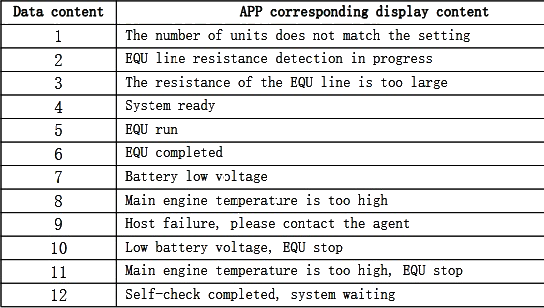
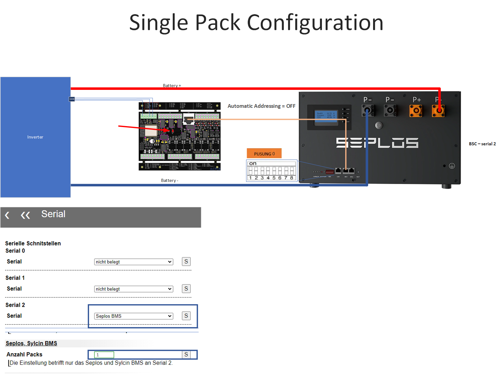
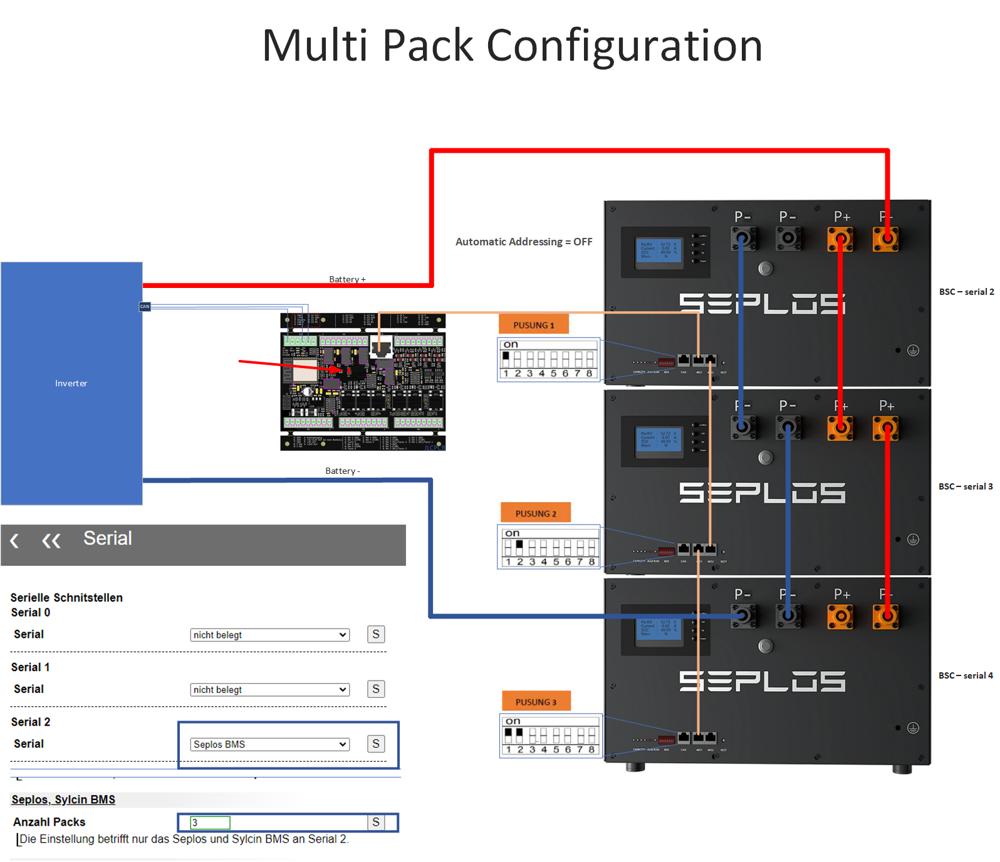
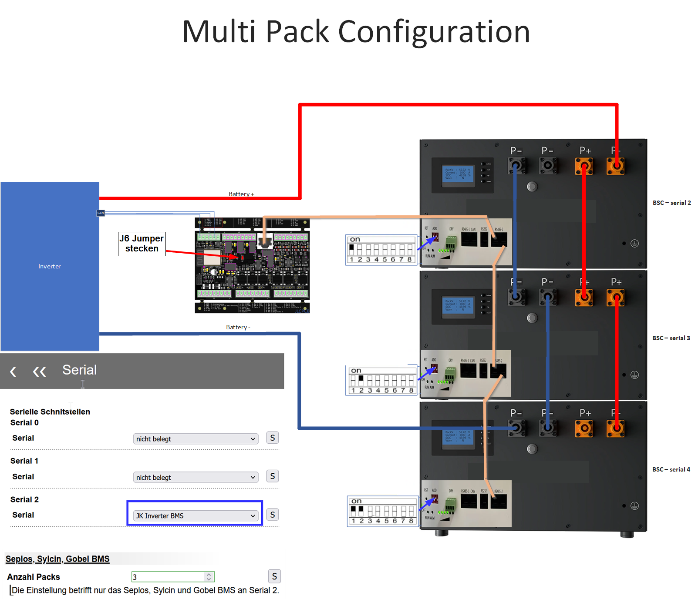
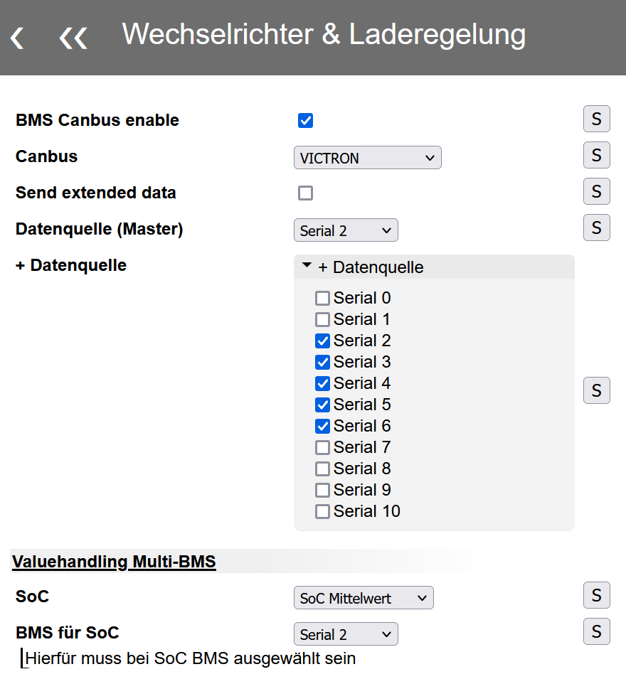
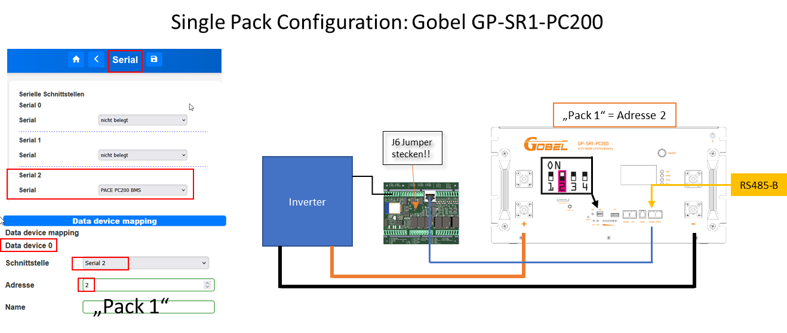
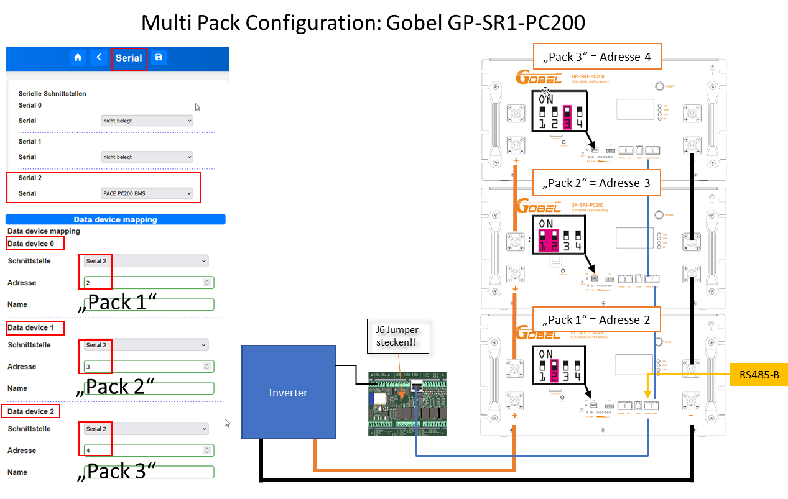
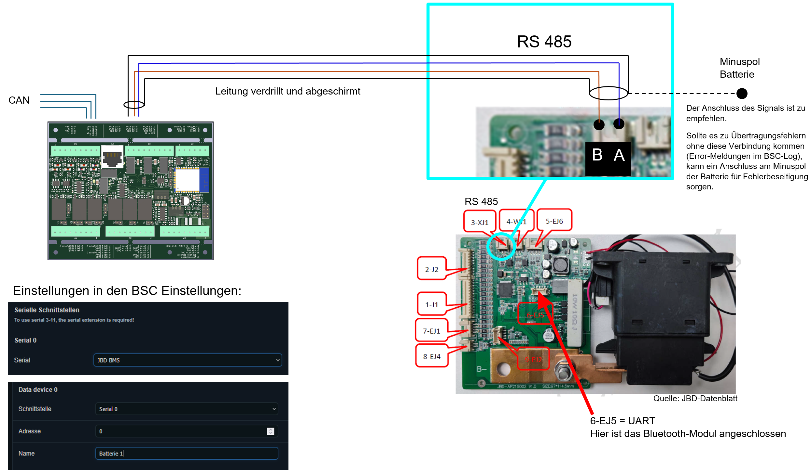

# Unterstützte BMS
Hier findest du eine Übersicht über die aktuell unterstützten Battery Management Systeme (BMS). 

## Integration weiterer BMS-Systeme
Die BSC-Plattform ist nicht auf die in der Tabelle aufgeführten BMS-Systeme beschränkt.  
Bei Vorliegen einer vollständigen Protokolldokumentation des Herstellers können weitere BMS-Systeme integriert werden. 

Für eine erfolgreiche Integration ist eine hinreichende Protokolldokumentation erforderlich.  
In Einzelfällen kann es notwendig sein, dass der Anwender die Kommunikation mit einem Logic-Analyzer aufzeichnet und zur Verfügung stellt, um die Implementierung zu verifizieren oder bei auftretenden Problemen zu unterstützen.  
Eine gewisse Eigeninitiative und technische Bereitschaft zur Mitwirkung sind hierbei vorausgesetzt.

Wenn Sie ein BMS-System einsetzen, das aktuell nicht unterstützt wird, sprechen Sie uns an.  
Die Integration zusätzlicher Systeme ist technisch realisierbar und kann bei entsprechendem Bedarf umgesetzt werden.

## Adsressierung
Die Tabelle enthält wichtige Informationen zu den Adressen, die für die Konfiguration erforderlich sind.

In den Spalten „Adresse Singlepack" und „Adresse Multipack" sind die Adressen durch einen Schrägstrich `/` getrennt angegeben:  
`0 / 1` heißt: Am BMS Adresse **0** einstellen, im BSC im Data-Device-Mapping Adresse **1** eintragen – die Werte können gleich oder verschieden sein.

- **Adresse Singlepack**: Diese Adresse wird am BMS und im Data-Device-Mapping eingestellt. Sie gilt für ein einzelnes BMS im System.

- **Adresse Multipack**: Diese Adresse ist die Start-Adresse, die am BMS und im Data-Device-Mapping konfiguriert wird. Sie gibt die Adresse des ersten BMS in einem Multipack-System an. Weitere BMS in der Kette erhalten automatisch fortlaufende Adressen, ausgehend von dieser Start-Adresse.

## Serial BMS
| Typ | HW-Version | SW-Version | Adresse Singlepack BMS / BSC| Adresse Multipack BMS / BSC | Anschluss BMS |
| ------------ | ------------ | ------------ | ------------ | ------------ | ------------ |
| **Jiabaida/JBD** |
| JBD-DP24S002 |  |  | - | - |
| [AP21S002](#jiabaidajbd-ap21s002) |  |  | - | - | RS485 |
| **JK Smart-BMS** |
| JK-B2A20S20P | V11.XW | 11.25H | - |  |  Single device extension (SDE) |
| JK-B2A24S20P | V10.XW | V10.09 | - |  |  Single device extension (SDE) |
| JK-B2A8S20P | V19 | V19.07 | - |  |   |
| JK BMS V1.3 (only monitoring) |  |  | - | - |
| **JK Inverter-BMS** |
| [JK-PB1A16S15P](#jk-inverter) | V14 | V14.20 | 1 / 1 | 1 / 1 |
| [JK-PB1A16S15P](#jk-inverter) | V15 | V15.17 | 1 / 1 | 1 / 1 |
| [JK-PB2A16S20P](#jk-inverter) | V15 | V15.17 | 1 / 1 | 1 / 1 |
| [JK-PB2A16S20P](#jk-inverter) | V19 | V19.10 | 1 / 1 | 1 / 1 |
| **Seplos** |
| [V2](#typ-10c-10e)| 10C |  | 0 / 0 | 1 / 1 |
| [V2](#typ-10c-10e) | 10E | 16.4 | 0 / 0 | 1 / 1 |
| [V3](#typ-v3)    |  |  | ? | - |
| **DALY Smart BMS** |
| BMS-*A |  | |  |  |  Single device extension (SDE) |
| **Sylcin (z.B. Taico Akku)** |
| [Sylcin](#sylcin) |  |  | 0 / 1 | 0 / 1 |
| **Pace (z.B. Gobel Akku)** |
| GP-SR1-RN150 (Test) |  | | 0 / 0 | - |
| [GP-SR3-PC100](#pace-pc100200) |  | |  2 / 2 | 2 / 2 | RS485B |
| [GP-SR1-PC200](#pace-pc100200) |  | |  2 / 2 | 2 / 2 | RS485B |
| PC200 V1 (RS232) |  | |  2 / 2 | - | RS232 |
| PC200 V2 (RS232) |  | |  2 / 2 | - | RS232 |
| **Pylontech** |  | | ? | ? |
| US2000 |  | | 1 / 1 | 1 / 1 | B/RS485 |
| US5000 |  | | 1 / 1 | 1 / 1 | B/RS485 |
| **Felicity** |
| LUX-Y Serie |  | | 0 / 0 | 0 / 0 |
| **Daren BMS** (TestStatus - Feedback erwünscht) |  | | ? | ? |

**Legende:**

- `-` = nicht unterstützt
- `?` = nicht dokumentiert
- leere Zelle = nicht geprüft
- (Test) = Teststatus

**Anschluss BMS – verwendete Begriffe:**

- **RS485**: direkter Anschluss an eine der seriellen Schnittstellen des BSC.
- **Serial-Extension**: Zusatzboard, das über die Erweiterungsschnittstelle des BSC angebunden wird und 8 weitere serielle Schnittstellen bereitstellt (in der Software „Serial 3" bis „Serial 10").
- **Single device extension (SDE)**: Adapter für den Anschluss von nicht RS485-kompatiblen Geräten (UART/RS232, z. B. der Victron SmartShunt). Über die SDE wird genau ein Gerät angeschlossen. Die SDE ist nicht mit der Serial-Extension identisch.
- **B/RS485** bzw. **RS485B**: Bezeichnung des RS485-Ports am jeweiligen BMS (Pylontech bzw. Pace).

## Bluetooth Devices
| Typ | HW-Version | SW-Version |
| ------------ | ------------ | ------------ |
|NEEY |
| NEEY Balancer 4A | 2.8.0 | 1.2.1 |
| NEEY Balancer 4A | 2.8.0 | 1.2.3 |
| NEEY GW-24S4EB | | |
| NEEY EK-24S4EB, EK-24S10EB | | |

Anbei die Auflösung der Statusmeldungen des NEEY:

{  width="520" }

## Anbindungs-Beispiele

### Seplos

#### Typ: 10C / 10E

Der BSC unterstützt den Anschluss der Gerätetypen 10E und 10C wahlweise als Einzelgerät oder als Mehrfachkonfiguration im DaisyChain-Verfahren. In beiden Betriebsarten erfolgt die Anbindung über einen RJ45-Anschluss.

##### Bedingungen / Tipps für einen MultiPack Daisy-Chain-Verbund:
* In der Seplos Software ist die automatische Adressierung deaktiviert (Upload Parameter -> auf der rechten Seite ganz nach unten)
* Die DIP Switch sind auf RS485 Konfiguration zu schalten
* Verbinden des BMS mit einem beliebigen Serialport des BSC  
Hinweis: [JP6](../hardware.md#j6-fur-den-regularen-betrieb) muss geschlossen sein.
* Falls es zu einem Problem im Verbund mit plötzlich nicht mehr antwortenden Seplos-BMS kommt, kann die Firmware 16.06.04 (oder evtl auch neuere) evtl. Abhilfe schaffen. Bei dem teilweise vorkommenden Problem lassen die BMS keine serielle Verbindung mehr zu, was nur mit einem BMS-Reboot wieder zu beheben ist.

##### Anschlussmöglichkeiten grafisch dargestellt

**Bei einer Kontaktierung über den RJ45 Anschluss muss [dieser](../hardware.md#j6-fur-den-regularen-betrieb) Jumper gesetzt werden.**

##### Besonderheiten

###### Zuordnung der Temperatursensoren in MQTT

| Datentopic  |Sensorname   |
| :------------ | :------------ |
|0-3 |Externe Kabelsensoren   |
|4   |Mosfet   |
|5   |Umgebung   |

###### Errorhandling
- Eine BSC-Warning ist im Seplos BMS eine "Warning" oder ein "Alarm"
- Ein BSC-Alarm ist im Seplos BMS eine "Protection"

##### Weiterführende Informationen
[Anleitung Firmware Update](../files/SEPLOS_BatteryMonitor_Firmware_updating_Guide.pdf)  
[FAQ Sammlung](https://akkudoktor.net/t/seplos-bms-faq-sammlung/8843) (Akkudoktor)

#### Typ: V3

##### Übersicht

Das Seplos V3 BMS kommuniziert über RS485 mit dem BSC.  
Ein direkter 1:1-Anschluss mit Standard RJ45-Kabeln ist **nicht möglich**.

Grund: Abweichende Pinbelegungen zwischen Seplos V3 und BSC.  
Die Verbindung muss mit einzelnen Adern nach der unten stehenden Pinbelegung erfolgen.

!!! warning "Wichtiger Hinweis zur Pinbelegung"
    Die GND-Pins im Seplos V3 Datenblatt (Pin 3, 6) sind für RS485-Kommunikation nicht funktional.      
    Nur **Pin 5** ist der gemeinsame GND bei beiden RS485-Ports.      
    Eine fehlerhafte Verkabelung führt zu Kommunikationsausfällen.

##### Pinbelegung Seplos V3

Die RS485-Schnittstelle des Seplos V3 BMS verfügt über zwei Ports.  
Beide Ports können verwendet werden.

**Korrekte Pinbelegung:**

| Seplos V3 Pin | RS485 |
|---------------|-------|
| 1/8 | B |
| 2/7 | A |
| 5 | GND |

##### Daisy Chain Limitation

!!! danger "Technische Einschränkung - Kein Daisy Chain möglich"
    Im Daisy Chain Modus wird das Master-BMS **nicht** vom BSC abgefragt.      
    Dies ist eine technische Limitation des Seplos V3 Kommunikationsprotokolls.      
     
Daisy Chain-Anbindung ist daher **nicht nutzbar**.  
Jedes Seplos V3 BMS muss einzeln an eine dedizierte serielle Schnittstelle angebunden werden.

##### Verkabelung

Standard RJ45-Kabel sind für den Anschluss nicht nutzbar.  
Die Verbindung muss mit Einzeladern hergestellt werden.

**Vorgehensweise:**

1. Einzelne Adern vom Seplos V3 RJ45-Port abisolieren
2. A, B und GND (Pin 5) mit der BSC RS485-Schnittstelle verbinden
3. Kabel möglichst kurz halten
4. Verdrillte Leitungen verwenden

### Sylcin

Anschluss von mehreren Akkus über Serial 2 vom BSC ist möglich. 

* Die Adressierung 1 aufwärts (ohne lücken) über die Dipschalter einstellen. Hierbei beachten, dass 0000 = Adresse 1, 0001 = Adresse 2 ist!
* BSC mit der Schnittstelle RS485-1 (nicht RS485-2) verbinden. 
* Jeder weitere Akku muss auch parallel an den jeweiligen RS485-1 angeklemmt werden. 
* Beim RS485-1 wird immer Pin 4 und 5 verwendet. 
* Beim RS485 Anfang und Ende des Bus mit einem 120Ohm Widerstand terminieren. 
* Bei einer Kontaktierung über den RJ45 Anschluss muss [dieser](../hardware.md#j6-fur-den-regularen-betrieb) Jumper gesetzt werden
* Einstellen des Sylcin BMS unter Serial 2
* Anzahl der Packs in den Einstellungen festlegen (siehe Bilder Seplos BMS)

Danach ist jedes Pack im BSC zu finden. Akku 1 -> BMS(2), Akku 2 -> BMS(3), ... 

### JK Inverter

Das JK Inverter BMS kann mit einem handelsüblichen RJ45-Patchkabel mit dem BSC verbunden werden.  
Dieser BSC-Port wird in der Software mit "Serial 2" benannt. Für die Benutzung dieser Schnittstelle muss JP6 geschlossen sein.  
Einzelne BMS, wie auch eine MultiPack-Konfiguration über DaisyChain ist möglich.  

#### Einstellung für DaisyChain in der JK App
* Bei einem DaisyChain-Verbund muss das UART Protokoll auf allen BMSen auf Protokoll 1  (JK BMS RS485 Modbus V1.0) umgestellt werden. 

#### Adressierung
Das BSC übernimmt die Rolle des Masters, die DIP Adresse 0 darf dadurch also nicht mehr an ein BMS vergeben werden.  
Jedes Pack bekommt eine eigene ID, welche über die DIP-Schalter zu definieren ist. Keine Adresse darf doppelt vergeben werden.  
Bitte überprüfen Sie die korrekte Adresse zusätzlich über die JK-App, da es in der Vergangenheit Blenden mit nicht korrekter 0/1-Bedruckung der Dipswitches gab.  

#### Physikalische Verbindung 

##### Einzel-Pack-Konfiguration
* Das JK BMS wird mit einem Patchkabel von einem rechten RJ45-Anschluss mit dem BSC verbunden.

##### MultiPack-Konfiguration als in Reihe geschalteten DaisyChain-Verbund
* Alle AkkuPacks über die rechten RJ45-Buchsen miteinander in Reihe verbinden
* Den BSC mit einem Patchkabel zu einem der freien rechten RJ45-Anschlüsse des JK-BMS verbinden

#### RS485 Datenübertragung (BMS) in der BSC-Software konfigurieren 
* Bei Direktanschluss über Serial2: Im BSC unter Einstellungen -> Schnittstellen ->  Serial2 das "JK Inverter BMS" auswählen, da nur eine Schnittstelle für mehrere Packs im DaisyChain-Verbund genutzt werden muss. 
* Die Device-Mapping-Konfiguration der angeschlossenen Geräte wird [hier](../settings_bsc_data_devices.md#data-devices) erläutert
* Danach sollte jedes Pack im BSC z.B. unter den Livedaten -> BMS Daten zu finden sein.  

#### CAN Datenübertragung (Inverter) konfigurieren
Für die Übertragung der Daten per CAN an z.B. ein Victron CerboGX, müssen Sie unter "Einstellungen -> Wechselrichter & Laderegelung -> Allgemein" folgende Einstellungen vornehmen:
 1. BMS Canbus enable selektieren
 2. CAN Protokoll auswählen z.B. VICTRON
 3. Nun die "Datenquelle" auf die entsprechenden Data-Devices (Serial 2) definieren
 4. Unter "Valuehandling" festlegen, wie der SoC zu übertragen / berechnen ist. "Mittelwert" z.B. übergibt den Mittelwert über alle angeschlossenen BMS.
 5. Die Batterietemperatur wird über die Einstellung "Batterietemperatur" festgelegt (die Max- und Min-Temperaturen über alle Packs hinweg bleiben davon unberührt). Für jedes weitere BMS unter "Datenquelle" eine weitere Serielle Schnittstelle entsprechend auswählen.  

{  width="550" }

#### Besonderheiten
##### Zuordnung der Temperatursensoren

Das JK-Inverter BMS besitzt vier anschließbare Temperatursensoren. Diese werden in der BSC-Software wie folgt zugeordnet:

| BSC ID| BMS
| ------------ | ------------ |
| 0 | T1 |
| 1 | T2 |
| 2 | MOS |
| 3 | T4 |
| 4 | T5 |

Ab V0.7.2_T4:

| BSC ID| BMS
| ------------ | ------------ |
| 0 | MOS |
| 1 | T1 |
| 2 | T2 |
| 3 | T4 |
| 4 | T5 |

### Pace PC100/200

Das Pace PC100 und PC200 BMS ist beispielsweise in den von Gobel Power verkauften GP-SR1-PC200 Akkupacks verbaut.  
Der BSC unterstützt hier das einzelne Pack, wie auch die Anbindung mehrerer Packs als DaisyChain-Verbund. In beiden Fällen wird lediglich ein einzelner serieller Anschluss am BSC benötigt.  
Als Verkabelung zum BSC kann ein handelsübliches RJ45-Kabel verwendet werden. Der Port am Akku-Pack ist auf den folgenden Bildern ersichtlich und mit RS485-B auf dem Pack gekennzeichnet.  
Die jeweilige Schnittstelle ist unter den seriellen Port-Einstellungen, wie auch im DeviceMapping zu definieren.  

#### Einzel-Pack-Konfiguration

Bei einer Einzel-Pack-Konfiguration fungiert das BSC als Master (Adresse 1), daher bekommt das angeschlossene Akku-Pack per Dipswitch die Adresse 2 zugeteilt.

#### Multi-Pack-Konfiguration

Auch bei einer Multi-Pack-Konfiguration fungiert das BSC als Master (Adresse 1).  
Die weiteren angeschlossenen Packs erhalten aufsteigend die Adressen 2 und folgende.

### Jiabaida/JBD AP21S002

### Bekannte Probleme

#### Fehlermeldung „Sonstiger Fehler“ in der BSC-Anzeige

Sollte beim ersten Start auf dem BSC-Dashboard die Fehlermeldung „Sonstiger Fehler“ angezeigt werden, muss ein Reset am JBD-BMS ausgeführt werden:

1. Beide Stecker mit den Kabeln der Zellverbindungen (1-J1 und 2-J2) abstecken und ca. 5min warten, bis alle Kondensatoren entladen sind.  
Danach wieder beide Stecker anstecken und anschließend prüfen, ob die Fehlermeldung weg ist.  
Sollte die Fehlermeldung noch bestehen ist, wie unter 2. beschrieben, vorzugehen.

2. Beide Stecker mit den Kabeln der Zellverbindungen (1-J1 und 2-J2) abstecken.  
Danach den Stecker des Bluetooth-Moduls (6-EJ5) abziehen.  
Anschließend die beiden Stecker 1-J1 und 2-J2 wieder einstecken und erst dann wieder den Bluetooth-Modul Stecker einstecken.

Anschließend überprüfen, ob die Fehlermeldung weg ist.

#### Relais-Aktivierung nach Reset

Nach einem Reset oder einer Schutzabschaltung kann das Relais im JBD-BMS geöffnet bleiben. Am Ausgang ist zwar die Batteriespannung messbar (über den Bypass-Widerstand), es fließt jedoch kein Strom.

**Ursache:**

Das BMS erkennt den Stromfluss über den Bypass-Widerstand nicht zuverlässig und schaltet das Relais nicht selbstständig zu.

**Lösung:**

Das Relais benötigt einen kontrollierten Stromimpuls zum Aktivieren:
- Labornetzteil auf Batteriespannung (z.B. 55,2V) und **max. 5A Strombegrenzung** einstellen
- Labornetzteil-Minus mit BMS-Ausgang Minus verbinden
- Labornetzteil-Plus kurz mit BMS-Ausgang Plus verbinden
- Der Strom fließt vom Labornetzteil durch den BMS-Shunt zur Batterie und aktiviert das Relais
- Alternativ: Kleine abgesicherte Last am BMS-Ausgang anschließen

**Warnung:** Ohne Strombegrenzung können gefährlich hohe Ströme fließen!
