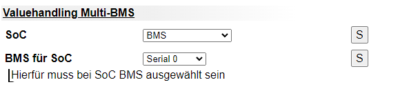

# Externe Shunts

## Victron SmartShunt

### Hardwareverbindung

Damit die Verbindung vom SmartShunt zum BSC hergestellt werden kann, muss zwischen dem VE.Direct Port und dem BSC ein entsprechender Konverter verwendet werden.  
Für alle nicht RS485 kompatiblen Geräte wurde daher die Single device extension entwickelt.  
Diese ist in unserem [Shop](https://bsc-shop.com/produkt/single-device-extension/) erhältlich.  

Ein galvanisch getrennter Typ ist hierbei nicht notwendig, da diese Trennung am BSC-Eingang ohnehin vorliegt.  
Der Anschluss erfolgt über ein übliches RJ45-Netzwerkkabel.

### Einstellungen BSC

#### Definition der seriellen Schnittstelle
Einstellungen -> Schnittstellen -> Serial -> Auswahl des Victron SmartShunt

#### Benötigtes Valuehandling
{  width="400" }

Einstellungen sind zu finden wie folgt
- Einstellungen -> Wechselrichter & Laderegelung -> Allgemein -> Valuehandling Multi-BMS -> SoC  
Selektion: BMS  

- Einstellungen -> Wechselrichter & Laderegelung -> Allgemein -> Valuehandling Multi-BMS -> BMS für SOC  
Selektion: Auswahl der Schnittstelle, wo der Smartshunt angeschlossen ist.  

Hierdurch wird nur noch der SoC des SmartShunt genutzt und an den Wechselrichter weiter geleitet.
