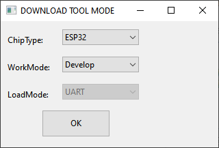
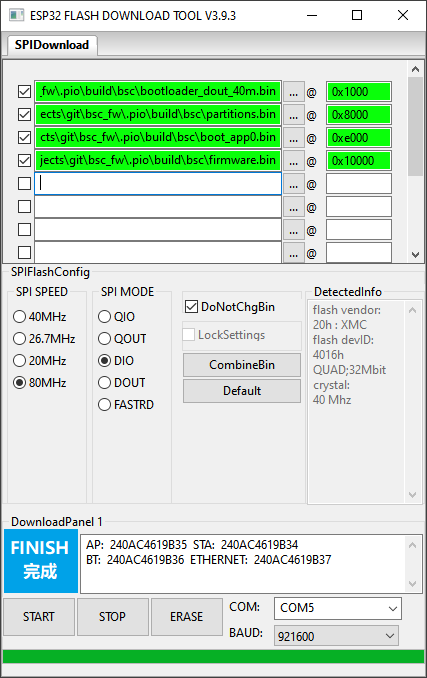
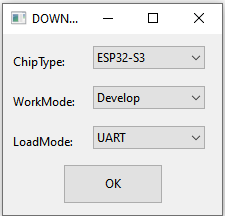
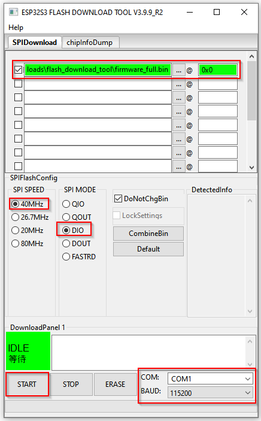

!!! info "Hinweis"
    Bei Problemen oder Rückfragen wenden Sie sich bitte an das entsprechende GitHub-Repository oder die Community-Supportkanäle.

## Flashanleitung - Orginal BSC von Lilygo
Der derzeitige Platinen-Lieferant versendet diese mit einer speziellen Firmware, die beim Kunden auf die aktuelle Release gebracht werden muss.  
Laden Sie dazu zuerst das aktuelle Release (bsc_firmware.zip) von [hier](https://github.com/shining-man/bsc_fw/releases) herunter um dieses zu entpacken.  Nun findet man eine Datei namens "firmware.bin", die die zu flashende Firmware repräsentiert.  

Das Upgraden der Firmware geschieht wie folgt:

1. Beim ersten Start der Firmware stellt der BSC einen WLAN-Accesspoint mit dem Namen "ESP-*" (ohne WLAN-Passphrase) zur Verfügung. Mit diesem WLAN bitte nun verbinden.
2. Nun die Webadresse "http://192.168.4.1/update" aufrufen. Achte Sie dabei auf die genaue Eingabe der URL.  
Falls ein Smartphone verwendet wird, könnte es sein, dass die Webadresse nicht aufgelöst werden kann. Wenn es zu diesem Problem kommen sollte, bitte die mobilen Daten des Smartphones für den Prozess ausschalten.
3. Laden Sie die zuvor entpackte Datei "firmware.bin" nun hoch. Weitere Dateien, wie z.B. das Dateisystem, werden nicht benötigt.
4. Nun dauert es ein paar Sekunden, bis das Gerät neu gestartet hat.
5. War der Prozess erfolgreich, blinkt eine LED auf der Platine. Sie können Sich nun wie [hier](#verbinden-mit-dem-bsc) beschrieben mit dem BSC verbinden um Ihre Konfigurationen vorzunehmen.


## Flashanleitung - Unprogrammierter orginal BSC
* Für die Erstinbetriebnahme einer unprogrammierten Platine müssen die vier herunterladbaren Dateien manuell geflasht werden.  
Die aktuellen Releases findet man [hier](https://github.com/shining-man/bsc_fw/releases).  
Bei der BSC-Hardware muss hierzu auf der dreipoligen Stiftleiste J2 (links oben auf dem Board; mit "Prog" beschriftet) ein USB-Seriell Konverter mit **3,3V-Pegel** angeschlossen werden.  
Ein 5V-Konverter kann den Controller schädigen.  

Bei den ESP32-Dev-Boards ist meistens direkt ein USB-Port vorhanden. Spätere Updates können über die Weboberfläche gemacht werden.

* Vor dem Flashen der Firmware muss das Board in den Download-Modus versetzt werden. Hierzu die Spannungsversorgung trennnen, dem Jumper J4 stecken und die Spannungsversorgung wieder einschalten. Nach erfolgreichem Flashen muss der Jumper J4 wieder entfernt werden, damit das Board normal anläuft.
* PCB Version >= V2.3: Der Jumper J6 darf während des Flashens nicht gesteckt werden, muss aber anschließend wieder gesteckt werden.
* Als Baudrate können Sie 921600baud verwenden. Wenn dies zu Problemen führt, kann diese auch auf 230400baud herab gesetzt werden
* Bitte löschen Sie den aktuellen Speicher des Moduls vor der Programmierung mit Hilfe der folgenden Tools.

### Flash-Möglichkeiten
#### Nutzen des Hersteller-Download-Tools (only Windows)
Die Software zum Flashen (Flash Download Tools) kann von der Hersteller-Webseite des ESP32 über [diesen Link](https://www.espressif.com/en/support/download/other-tools) bezogen werden.  
In dieser Software müssen die Einstellungen, wie in den folgenden Screenshots gezeigt, vorgenommen werden:  

  

Im folgenden Bildschirm müssen die Firmware-Dateien hinterlegt und noch ein paar Einstellungen getätigt werden.  
Dabei darauf achten, dass die Häkchen neben den einzelnen Dateien gesetzt sind und die jeweilige Zeile grün hinterlegt wurde.  
  

➔ Nun können Sie den Upload-Vorgang mit einem Klick auf "Start" starten.

#### Flashen mit dem esptool (Linux, Windows) inkl. zuvorigen Löschen
`esptool.py  --port /dev/ttyUSB0 --chip auto write_flash -e -ff 80m -fm dio 0x01000 bootloader.bin 0x08000 partitions.bin  0x0e000 boot_app0.bin 0x10000 firmware.bin`

#### Flashen über den Browser
Bei Verwendung eines Chrome Browsers kann auch das durch Adafruit zu Verfügung gestelltes [Online-Tool](https://adafruit.github.io/Adafruit_WebSerial_ESPTool/) zum Flashen verwendet werden.  

Nach erfolgreicher Verbindung zu dem Controller können die 4 Dateien der aktuellen Firmware mit den passenden Zieladressen geflashed werden:

* bootloader.bin - 0x1000
* partitions.bin - 0x8000
* boot_app0.bin - 0xe000
* firmware.bin - 0x10000

### Test-Versionen flashen
Für das Flashen von Test-Versionen gibt es zwei Möglichkeiten:

1. Sie können das einzelne Test-Firmware-File "firmware.bin" direkt über den Web-Browser und der OTA-Funktionalität innerhalb des BSC-Webfrontend flashen.  
Diese finden Sie im Menü /Einstellungen/Update.
2. Andernfalls können Sie die jeweilige "firmware.bin" zusammen mit den drei weiteren Dateien aus dem Release hierzu verwenden.  
Das weiter oben beschriebene Gesamt-Flash-Prozedere bleibt hierbei unverändert.

## Flashanleitung – LILYGO T-CONNECT
Für die **Erstinbetriebnahme** des LILYGO T-CONNECT Boards muss die Firmware manuell geflasht werden. Es stehen zwei Firmware-Versionen zur Verfügung:

- **Standard-Version**
- **Sponsoren-Version (Insider)**

Die benötigten Dateien sind auf GitHub in den entsprechenden Repositories unter den Releases zu finden:

- [Standard-Firmware](https://github.com/shining-man/bsc_fw/releases)
- [Insider-Firmware](https://github.com/bsc-org/bsc_fw_insider/releases)

### Schritt 1: Firmware herunterladen
Laden Sie die Datei `firmware_tconnect_**full**_xx_xx.bin` herunter.  
Dabei steht `xx_xx` für die gewünschte Sprache (z. B. `de_DE`, `en_US`).

!!! info "Wichtig"
    Verwenden Sie **ausschließlich** die Datei mit dem Zusatz `full`.

### Schritt 2: Board vorbereiten
Verbinden Sie das T-CONNECT Board per USB mit dem Computer.

Um das Gerät in den **Download-Modus** zu versetzen:

1. **BOOT-Taste gedrückt halten**
2. **RESET-Taste kurz drücken**
3. **BOOT-Taste loslassen**

Das Board befindet sich nun im Flash-Modus.

### Schritt 3a: Flashen mit dem Espressif Flash Download Tool (nur Windows)
Das offizielle Tool kann hier heruntergeladen werden:  
👉 [ESP Flash Download Tool](https://www.espressif.com/en/support/download/other-tools)

**Konfiguration:**

1. Starten Sie das Tool und wählen Sie **ESP32-S3** als Zielgerät

2. Tragen Sie die Firmware-Dateien ein und setzen sie die Einstellungen wie im Screenshot gezeigt.

3. Stellen Sie sicher, dass:
    - Der richtige COM-Port ausgewählt ist
    - Die Checkboxen aktiviert sind
    - Die Zeilen grün hinterlegt sind

➤ Starten Sie den Vorgang mit einem Klick auf **„START“**.

### Schritt 3b: Flashen mit dem esptool.py (Linux & Windows)
Das Flashen kann alternativ über das Python-Tool `esptool.py` erfolgen.

**Beispielbefehl (inkl. Flash löschen):**

```bash
esptool.py --chip esp32s3 --port /dev/ttyUSB0 --baud 921600 write_flash -e 0x0 firmware_tconnect_full_xx_xx.bin 
```

!!! note "Hinweis"
    Stellen Sie sicher, dass die `.bin`-Datei im aktuellen Arbeitsverzeichnis liegt.

### Schritt 4: Neustart des Boards
Nach erfolgreichem Flashvorgang muss das Board neu gestartet werden.  
Drücken Sie dazu einmal kurz die **RESET-Taste** auf dem T-CONNECT Board.

Damit wird die neue Firmware geladen und das System startet im Normalbetrieb.

Sie können Sich nun wie [hier](#verbinden-mit-dem-bsc) beschrieben mit dem BSC verbinden um Ihre Konfigurationen vorzunehmen.


## Verbinden mit dem BSC 
Voraussetzung ist, dass die Platine programmiert ist!

* Beim ersten Start der Firmware stellt der BSC einen Accesspoint mit dem Namen "bsc_*" zur Verfügung.
* Nach dem Verbinden mit dem Accesspoint ist dieser unter der IP-Adresse 192.168.4.1 oder bsc.info erreichbar und kann konfiguriert werden.
* Zugangsdaten: 
    - Benutzername: bsc
    - Passwort: admin
