## Hardwarevoraussetzungen
Um sämtliche Funktionen der Firmware nutzen zu können, wird die zum BSC-System gehörige Hardware benötigt. Eine detaillierte Beschreibung dieser Hardware, einschließlich des [Stromlaufplans](https://github.com/shining-man/bsc_hw/blob/main/circuit.pdf?raw=true), finden Sie in einem separaten [GitHub-Repository](https://github.com/shining-man/bsc_hw).

Wir empfehlen ausdrücklich die Verwendung der originalen BSC-Hardware. Diese wurde umfassend getestet und bietet galvanisch getrennte Anschlüsse, wodurch ein stabilerer Betrieb gewährleistet wird.  
Gerne besuchen Sie hierzu unseren Webshop unter <a href="https://bsc-shop.com" target="_blank">www.BSC-Shop.com</a>.

Falls die originale BSC-Hardware nicht verfügbar ist, ist die Empfehung als Alternative das T-CONNECT von Lilygo einzusetzen. Auch hier sind die RS485 Anschlüsse und der CANBUS galvanisch getrennt. Bitte beachten Sie, dass in diesem Fall bestimmte Funktionen eingeschränkt sind.  
**Wichtig:** Beim Kauf unbedingt darauf achten, dass die **Variante mit 3× RS485 und 1× CAN-Schnittstelle** gewählt wird!  
Weitere Informationen zur Hardware des Lilygo T-CONNECT siehe [hier](#lilygo-t-connect).  
Das T-CONNECT kann z.B. hier bezogen werden: [LILYGO T-CONNECT auf AliExpress](https://de.aliexpress.com/item/1005007619430455.html)  

Für erste Tests kann alternativ ein ESP32-Dev-Kit verwenden. Beachten Sie jedoch, dass einige Funktionen eingeschränkt oder nicht getestet sind. Weitere Informationen finden Sie unter folgendem [Link](BSC_ohne_orig_hardware.md).

## Orginale BSC Hardware
### Anschlüsse
Ein Techtalk über die Anschlussmöglichkeiten kann auf [Youtube](https://youtu.be/zwu_jJifkF4?si=2ktcM57JjkR39Dph) angesehen werden.

**Korrektes Kontaktieren der Schraubklemmen:**
Um eine fehlerfreie Installation zu gewährleisten, beachten Sie bitte folgende Hinweise zum Anschluss der Schraubklemmen:

  1. **Markierung von Pin 1:**  
  Jede Schraubklemme ist mit einer Ziffer "1" gekennzeichnet, die den Pin 1 der jeweiligen Klemme angibt. Diese Markierung dient als Referenz für den korrekten Anschluss.

  2. **Beschriftung der Funktionen:**  
  Neben der Markierung von Pin 1 befindet sich eine Beschriftung, die die jeweilige Funktion der einzelnen Kontaktstellen beschreibt. Lesen Sie diese sorgfältig, um die richtigen Verbindungen herzustellen.

  3. **Wichtige Sicherheitshinweise:**  
  Achten Sie unbedingt darauf, die Anschlüsse korrekt vorzunehmen!  
  Falsche Verbindungen können Schäden am BSC oder an extern angeschlossenen Komponenten verursachen.

  4. **Illustrationen und praktische Hinweise:**  
  Die in dieser Dokumentation enthaltenen Abbildungen dienen lediglich der Veranschaulichung. Überprüfen Sie daher immer die Markierungen und Beschriftungen auf Ihrer Platine, um die korrekten Anschlüsse sicherzustellen.

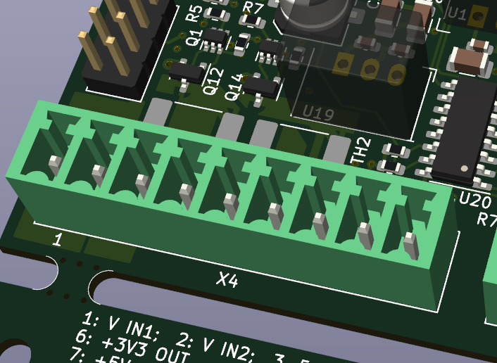{ width="300" }
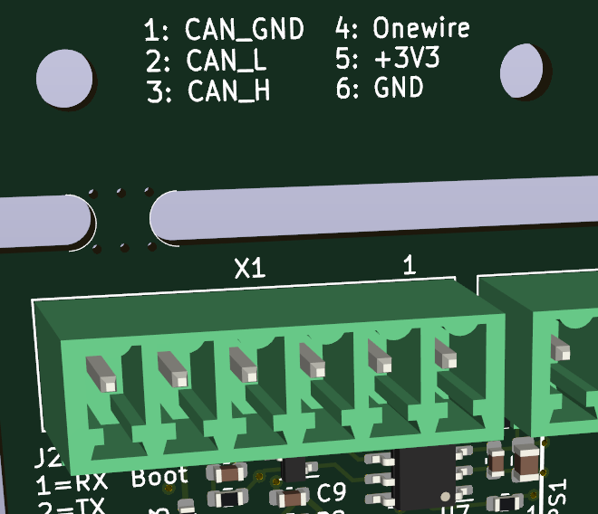{ width="300" }

### Stromversorgung
Die jeweils zu nutzenden Pins finden Sie als "V IN1" für "+" und GND für "-" aufgedruckt auf Ihrer PCB. Der Betrieb der BSC-Hardware ist in der Standard-Auslieferung für 5V (>=1,5A) ausgelegt. Als stabile Lösung in Sachen Netzteile haben sich Hutschienen-Varianten der Firma Meanwell bewährt, welche man über den <a href="https://bsc-shop.com" target="_blank">BSC-Shop</a>
 erwerben kann.

Die Spannungsversorgung sollte redundant erfolgen, d.h. eine Ausfallsicherheit der Versorgung hergestellt werden. In diesem Fall wird, falls ein Netzteil keine Spannung mehr liefert, das Zweite einschreiten und die Platine ohne Unterbrechnung weiterversorgen. Somit könnte die Platine an ein direkt aus dem Akku versorgten DC/DC Netzteil und ein an das EVU-Netz angeschlossenen AC/DC Netzteil angeschlossen werden. Hierfür bietet das BSC zwei separate Eingänge an. Um zu definieren welche Spannungsquelle die Primärspannungsquelle ist, sollte diese ca. 0,2V höher eingestellt werden. Dann übernimmt die Stromversorgung des BSCs das Netzteil mit der höher eingestellten Spannung.

**Erhöhung der Spannungsversorgung:** 

Bei Bedarf ist es möglich die Spannungsversorgung auf mehr als 5V zu erweitern (z.B. 12V / 24V).  

Dabei sind folgende Bedingungen zu beachten:  
> Achtung, die Platinenkennzeichnung hat sich zwischen verschiedenen Hardwarerevisionen geändert. Angegeben sind diese folgend immer als HwRev < 2.5 / HwRev >= 2.5

* JP28 / R61 (Versorgungsspannung für die BSC-Komponenten):
    * Dieses ist im Normalfall gebrückt und muss für höhere Versorgungsspannungen größer 5V getrennt werden.  
      Das Bauteil ist durch seine Bedruckung auf der Rückseite der Platine, direkt neben den Lötanschlüssen von U19 zu finden.
* JP29 / R91 & JP25 (Relais-Spannungsversorgung):
    * Beim Einsatz von 5V Relais ist keine Änderung an diesen Jumpern notwendig
    * Wenn JP25 zur Schleiferkontaktierung der Relais genutzt wird, dürfen Spannungen nur bis 24V genutzt werden.
    * Wenn eine höhere Versorgungsspannung > 5V ohne Belastung von U19 für die Relais gewünscht ist
      * Hw-Rev < 2.5
         * Beim Einsatz von Relais höherer Spannung, die Verbindung 2-1 trennen und 3-2 mit dem Lötkolben überbrücken  
      Hinweis: Beim BSC V2.3 ist die Beschriftung der Jumper von JP29 falsch! Aufgedruckt ist 1 links, aber 1 ist auf der rechten Seite.
      * Hw-Rev >= 2.5
         * Beim Einsatz von Relais höherer Spannung, Widerstand R91 entfernen und Lötjumper JP25 setzen.
* Bei Versorgungsspannungen größer 19V können Bauteildefekte bei verpolten Anschliessen entstehen. Bitte achten Sie hier explizit die Anschlusspolarität um Probleme zu vermeiden.
* U19 ist für eine **höhere Versorgungsspannung** größer 5V mit einem DC-DC Wandler zu bestücken
    * Bis 34V Eingangsspannung werden im <a href="https://bsc-shop.com" target="_blank">BSC-Shop</a> passende DCDC-Module angeboten.
    * Zur rendundanten Spannungsversorgung, oder Spannungen über dem genannten Wert, werden getrennte 5V Netzteile im <a href="https://bsc-shop.com" target="_blank">BSC-Shop</a> angeboten.
    * Der viereckige Lötpunkt bei U19 ist der 5V Ausgang des DC/DC Wandlers. Hierbei unbedingt auf Polarität achten!
        * Wenn 5V Relais verwendet werden, bitte beachten, dass diese durch den Spannungsregler U19 mitversorgt werden, daher >=1A DC-DC Wandler verwenden
        * Hier ein Beispiel der U19 Bestückung:  
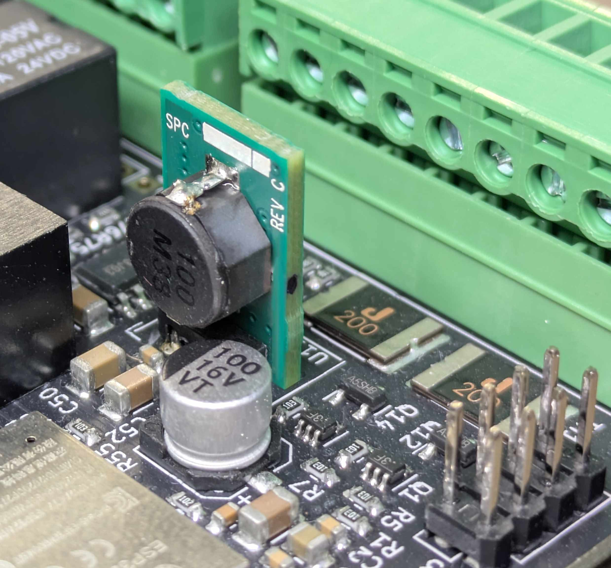{ width="400" }

### CAN/RS485
Alle Schnittstellen sind galvanisch getrennt und können somit ohne jegliche Adapter direkt an ein BMS (RS485 -> Serial0-10) oder Inverter (CAN) angeschlossen werden.  
Die Spannungs-Pegel der genannten Schnittstellen sind "genormt".  

### RS485 (BMS)
Einige übliche BMS-Typen können direkt über die RJ45-Buchse kontaktiert werden.  
Wenn Sie mehrere Geräte direkt mit RJ45 anschließen möchten, kann dies teilweise als DaisyChain, oder mit Hilfe des RJ45-Serial-Distributor aus dem <a href="https://bsc-shop.com" target="_blank">BSC-Shop</a> erfolgen.

### OneWire
An die OneWire-Schnittstelle können, ohne zusätzliche weitere Hardware, Temperatursensoren angeschlossen werden.  
Die dafür normalerweise notwendigen Pullup-Widerstände sind auf der BSC-Platine schon integriert.

### Temperaturmanagement
Das BSC benötigt eine leichte Thermik zur Kühlung der Platinen-Oberseite.  
Bitte packen Sie die Platine nicht unnötig ein und sorgen Sie für eine kontinuierliche Belüftung.

### Wie trennt man Lötjumper
Hierzu müssen teilweise die in der Auslieferung gesetzten Lötjumper mechanisch entfernt werden.  
Dies geschieht am Besten mit einem "Dremel", der nur an der Oberfläche die Kupferschicht entfernt.  
Vorsicht! Es gibt weitere Kupferschichten innerhalb der Platine, diese dürfen natürlich nicht verletzt werden.  
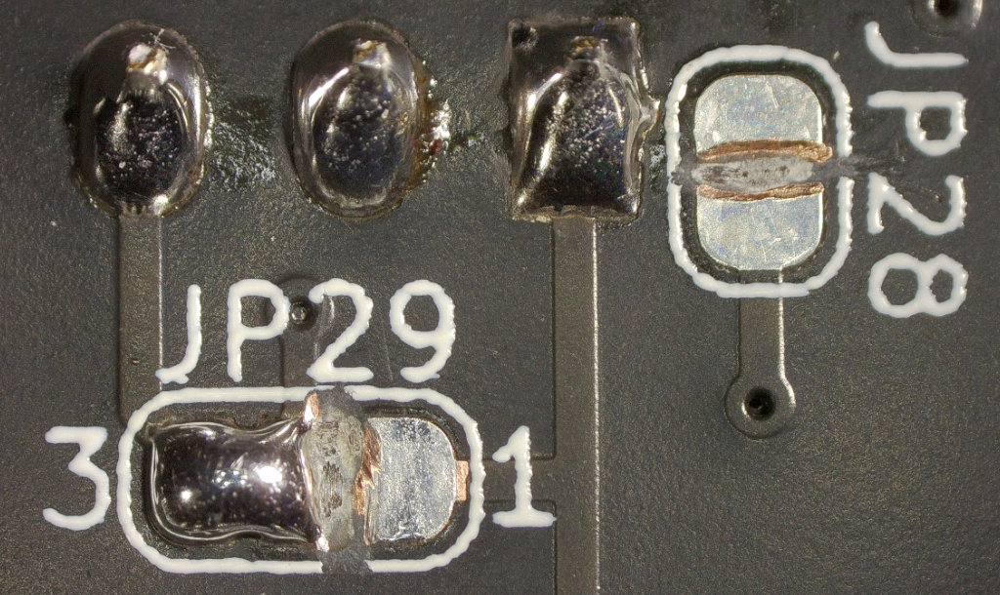{ width="600" }

### Jumper Konfiguration

#### J6 für den regulären Betrieb
Das Öffnen von Jumper J6 wird zur Programmierung einer unprogrammierten Platine benötigt.  
Für den normalen Betrieb ist dieser zu setzen.  
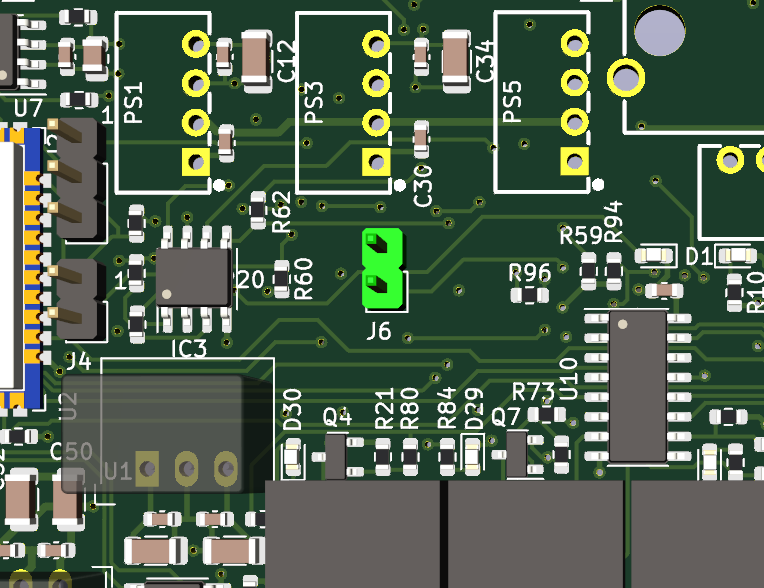{ width="400" }

#### J4 zur Programmierung
Das setzen von Jumper J4 wird zur Programmierung einer unprogrammierten Platine benötigt.  
Für den normalen Betrieb bleibt dieser offen.  
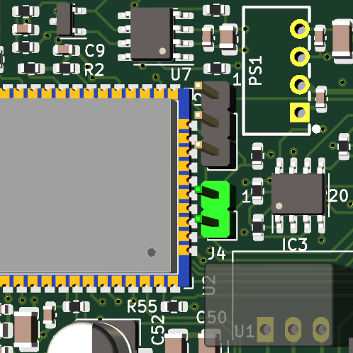{ width="400" }

#### Mittelabgriffe der Relais mit Vin verbinden
Die Mittelabgriffe (COM) der Relais können durch setzen der jeweiligen Jumper mit dem Vin der Platine verbunden werden.  
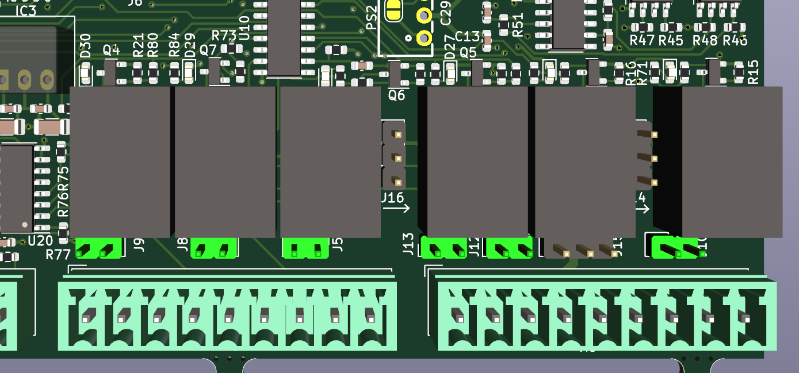{ width="600" }

#### J14-J16 Aktivieren der Ausgänge
Diese Relais haben weitere Funktionalitäten, die derzeit nicht mit der Firmware abgebildet sind.  
Daher müssen die Jumper auf die blau markierten Positionen gesetzt werden.  
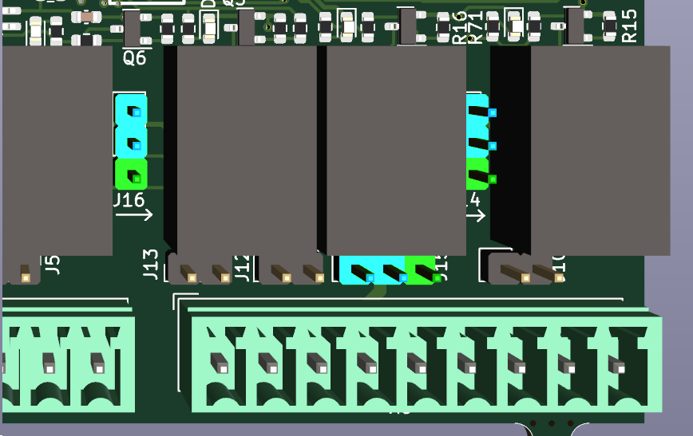{ width="600" }

## Lilygo T-CONNECT
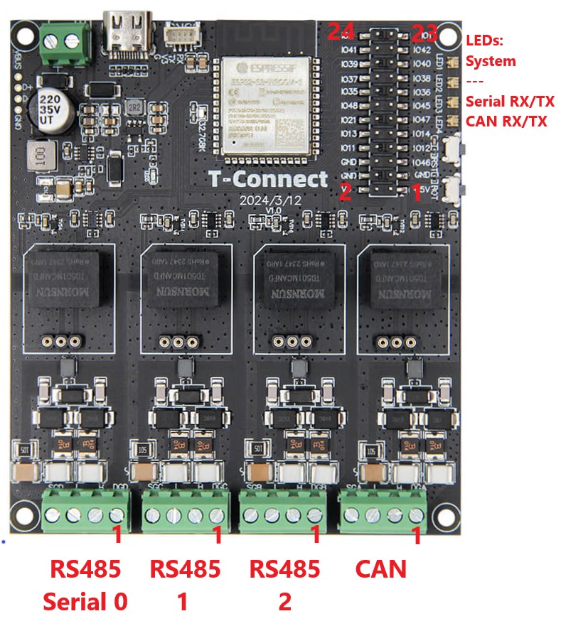{ width="550" }

#### Steckerbelegung
**Serial 0-2 (RS485)**  
Pin 1: ---  
Pin 2: B  
Pin 3: A  
Pin 4: GND  

**CAN**   
Pin 1: ---  
Pin 2: H  
Pin 3: L  
Pin 4: GND  

#### Funktion der LEDs  
| LED            | Farbe          | Funktion                              |
|----------------|----------------|---------------------------------------|
|  System        | Blau           | System bootet                         |
|  System        | Grün - blinken | System ist fehlerfrei                 |
|  System        | Rot - blinken  | Einer der System-Task antwortet nicht |
|  Serial RX/TX  | Rot - blinken  | Kommunikation mit einem BMS           |
|  CAN RX/TX     | Rot - blinken  | Versenden einer CAN Nachricht         |

#### Belegung des Pin-Headers
Mit der Standard Firmware Version kann nur Onewire genutzt werden. Alle weiteren Funktionen (Relais, Digitaleingänge, I²C) können nur mit der Insider Version genutzt werden.

| PIN | GPIO | Funktion         |
|-----|------|------------------|
|  1  |      | 5V               |
|  2  |      | 3.3V             |
|  3  |      | GND              |
|  4  |      | GND              |
|  5  |  46  | ---              |
|  6  |      | GND              |
|  7  |  12  | I²C SCL          |
|  8  |  11  | I²C SDA          |
|  9  |  14  | SE RX            |
| 10  |  13  | SE TX            |
| 11  |  47  | ---              |
| 12  |  21  | Onewire          |
| 13  |  45  | ---              |
| 14  |  48  | ---              |
| 15  |  36  | Digitaleingang 1 |
| 16  |  35  | Digitaleingang 2 |
| 17  |  38  | Digitaleingang 3 |
| 18  |  37  | Digitaleingang 4 |
| 19  |  40  | Relais 1         |
| 20  |  39  | Relais 2         |
| 21  |  42  | Relais 3         |
| 22  |  41  | Relais 4         |
| 23  |   1  | Relais 5         |
| 24  |   2  | Relais 6         |

## BSC Display
Das Display für den BSC wurde in ein [separates Projekt](https://github.com/shining-man/bsc_display) ausgegliedert in dem auch die Firmware zu finden ist.

### Unterstützes Display
Hardware-Version 3.3 des Displays wurde getestet.  
Erhältlich beispielweise über Aliexpress von verschiedenen Versendern.  
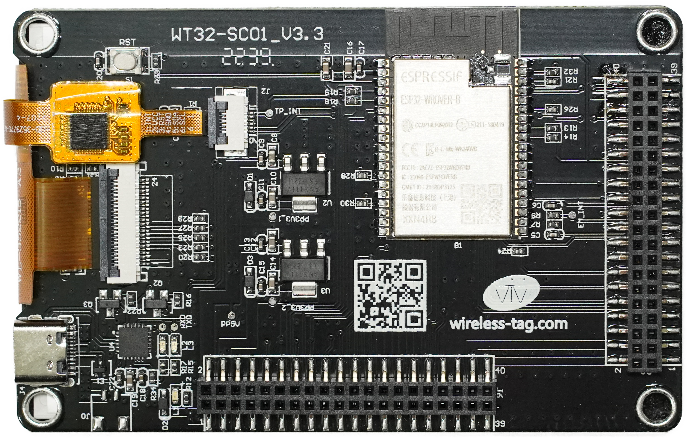{ width="500" }

### Anschluss an das BSC-Mainboard
Der Anschluss dessen erfolgt über den Extension-Port "J3":

* Die Datenverbindung über den hier kontaktierbaren I²C-Bus der Pins "SCL/SDA", welche 1:1 anzuschließen sind.
* Eine 5V Spannungsversorgung für das Display ist auch abgreifbar. Diese muss, zusammen mit GND, mit dem dazu passenden Anschluss Ihres Displays verbunden werden.
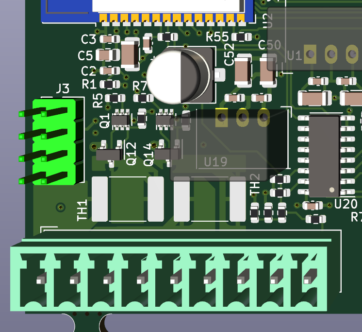{ width="400" }
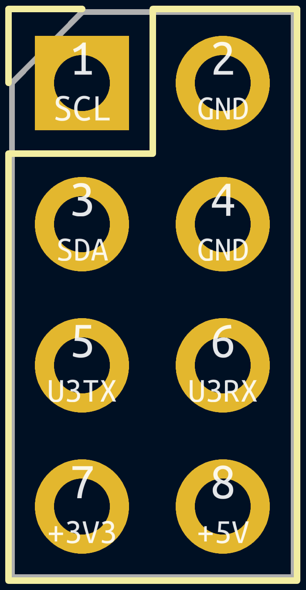{ width="200" }

### Pinout des Displays "WT32-SC01"
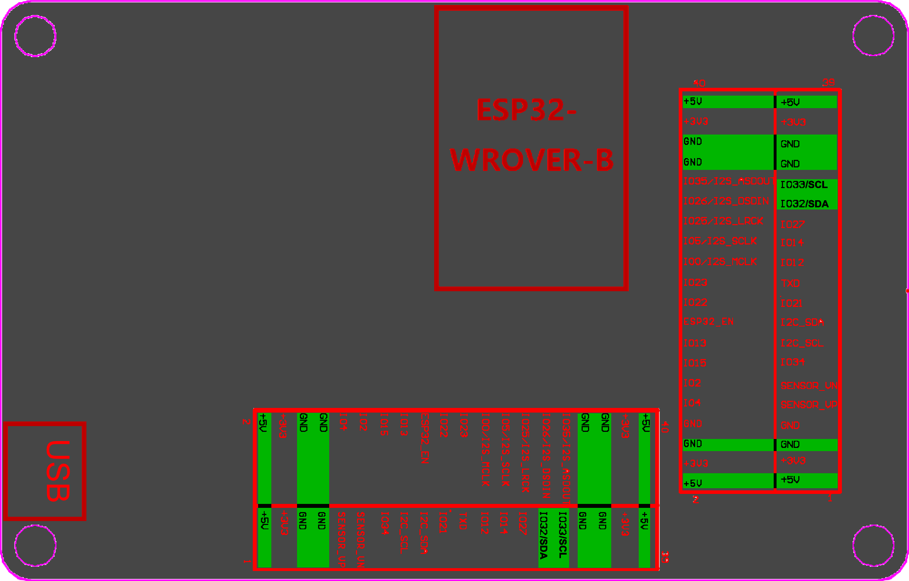{ width="700" }
