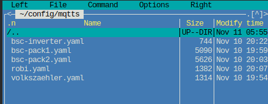
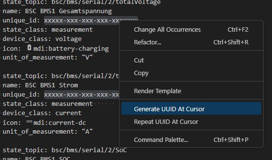
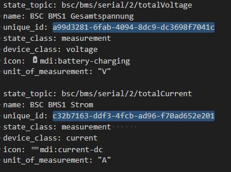

## Virtual Trigger

Es gibt zu jedem der 27 internen Trigger, einen von ausserhalb ansteuerbaren virtuellen Trigger, die "vTrigger".  
Diese können per MQTT oder der [Restapi](restapi.md/#5-vtrigger-post) gesetzt werden.  
Jeder vTrigger setzt intern seinen korrespondierenden Trigger auf den gesendeten boolschen Wert (0/1).  

### Zustands-Speicherung

Es gibt zwei Möglichkeiten die vTrigger "speichernd" über einen Reboot hinaus zu erhalten:  
  
1) Das Setzen der Trigger mit MQTT kann mit der Option "retain" erfolgen.    
Sobald das BSC wieder am Broker angemeldet wurde, wird der bisherige Trigger-Zustand durch diesen im BSC automatisch aktualisiert.  

2) Für jeden vTrigger kann über das BSC-Menü festgelegt werden, ob er speichernd angelegt werden soll.  
Diese Einstellungen der Remanenz befindet sich unter „System“ bei den [MQTT-Optionen](settings_bsc.md/#mqtt-einstellungen).

### MQTT-Beispiel
Die vTrigger sind erst einmal nicht über z.B. den MQTT-Explorer sichtbar.  
Erst wenn ein vTrigger einmal von extern gesetzt wurde, wird dieser auch im MQTT-Explorer dargestellt.  

#### Adresse der vTrigger in MQTT  
`{Device Name}/input/vtrigger/{Trigger Nummer}`

| Platzhalter  |Beschreibung   |
| ------------ | ------------ |
| {Device Name} |  "MQTT Device Name" aus den System-Settings|
| {Trigger Nummer} | Trigger-ID von 1 bis 27 |

#### Zu sendende Payload  
0 -> Trigger Low  
1 -> Trigger High

## Home Assistant Auto-Discovery

Der BSC bringt eine **eingebaute Home-Assistant-Auto-Discovery** mit: Auf Knopfdruck erstellt der BSC die Entities der bekannten Werte automatisch in Home Assistant – eine manuelle Pflege von YAML-Konfigurationen ist nicht mehr nötig.

```bsc-settings
version: v010
file: mqtt.json
profile: off
label: Home Assistant
```

- **Home Assistant Discovery Prefix** – Discovery-Topic-Präfix, unter dem Home Assistant die Discovery-Nachrichten erwartet (Standard: `homeassistant`).
- Über den Button **HA Discovery senden** werden die Discovery-Nachrichten an Home Assistant gesendet.

!!! note "Hinweis"
    Der unten beschriebene manuelle YAML-Weg bleibt gültig und kann z. B. für Sonderfälle oder individuelle Anpassungen genutzt werden. Für die Standard-Anbindung wird die eingebaute Auto-Discovery empfohlen.

## MQTT-Filter

Mit dem MQTT-Filter kann gesteuert werden, **welche Daten** der BSC per MQTT veröffentlicht. Das reduziert unnötigen Datenverkehr und hält die Topics übersichtlich.

### Data Devices

```bsc-settings
version: v010
file: mqtt.json
profile: off
label: Data Devices
```

- **Data Devices senden** – Schaltet die Veröffentlichung der Data-Device-Daten ein oder aus (Standard: ein).
- **Data Devices Auswahl** – Auswahl der Data-Devices, deren Daten gesendet werden.
- **Datenklassen** – Auswahl der Datenklassen, die gesendet werden. Standardmäßig werden alle 7 Klassen gesendet:
    - Gesamtspannung/Strom, SoC, FET-State
    - Zellspannungen
    - Restliche Zelldaten
    - Balancerdaten (inkl. Balance-Status)
    - Errors, Warnings
    - Temperaturen
    - Kapazität/Energie/Statistik

Die Topics `valid` und `maintenance` werden unabhängig von der Auswahl immer gesendet.

### Group Devices

```bsc-settings
version: v010
file: mqtt.json
profile: off
label: Group Devices
```

Gleiche Struktur wie bei den Data Devices: **Group Devices senden**, **Group Devices Auswahl** und **Datenklassen**. Diese Sektion ist nur relevant, wenn [Group Devices](settings_bsc_group-devices.md#group-devices-batterie-gruppen) aktiviert sind.

### Weitere Daten

```bsc-settings
version: v010
file: mqtt.json
profile: off
label: Weitere Daten
```

Legt fest, welche weiteren Datenkategorien gesendet werden (Standard: OneWire, Inverter, Trigger und System aktiv):

- **OneWire** – Daten der OneWire-Sensoren.
- **Inverter** – Daten der Wechselrichter-Kommunikation.
- **Trigger** – Zustand der Trigger/Alarme.
- **System** – Systemdaten (z. B. Free Heap, Task-Zustände).
- **Zellspannungsabfall (Debug)** – Debug-Daten der Überwachung „Zellspannung bei Ladestrom“ (standardmäßig aus).

## MQTT in Verbindung mit Home-Assistant

### Integration
Um die Übersichtlichkeit der configuration.yaml zu wahren, können getrennte MQTT-Config-Dateien genutzt werden.  
Sinnvoll ist es z.B. pro angebundener Hardware eine Datei zu generieren.  

!!! note "Hinweis"
    Mit der eingebauten [Home Assistant Auto-Discovery](#home-assistant-auto-discovery) ist die folgende manuelle Konfiguration in der Regel nicht mehr erforderlich.

Folgende Programmzeile ist in der "config/configuration.yaml" zu hinterlegen:

```yaml
mqtt:
  - sensor: !include_dir_merge_list mqtts/
```
Die einzelnen MQTT-Konfigurationen werden dann in einem Unterverzeichnis namens "mqtts" hinterlegt.
Dieses muss händisch erstellt werden.



Nun müssen die .yaml Dateien an dieser Stelle abgelegt werden.
HomeAssistant wird jede der Dateien beim Boot einlesen und auswerten.

#### Beispielkonfigurationen
Folgend findet Ihr Beispielkonfigurationen für verschiedene Hardware:

* BSC intern
* BMS
* Inverter
* Neey-Balancer

##### Konfiguration anpassen
Die Dateien müssen zur Integration statt ".txt" in ".yaml" umbenannt werden.
Leider unterstützt Github .yaml nicht.  

###### DataDevices
Der DataDeviceName muss von Ihnen, je nach BSC-Konfiguration, korrekt in den Dateien benamt werden.  
Die Stelle hierzu ist mit dem Kürzel "{DataDeviceName}" markiert.  
{DataDeviceName} = Definierter Klartext-Name im Data device mapping.

###### UniqueID
Innerhalb der Dateien gibt es pro Sensorwert eine UniqueID welche von jedem definiert werden muss.  
Generieren kann man diese beispielsweise mit der "Version 1" auf https://www.uuidgenerator.net/version1 .

Alternativ kann man sehr komfortabel über das Addon namens "Visual Studio Code Server" innerhalb Home-Assistant alle zu ersetzende UUIDs auf einmal ändern.
Die selbe Vorgehensweise funktioniert über VisualStudioCode mit dem Addon "UUID Generator von netcorext".

- Markieren des temporären Strings "xxxxx-xxx-xxx-xxx-xxxxx"
- Rechtsklick -> "Change all Occurrences"  
  
- Rechtsklick -> "Generate UUID at Cursor"  

  
=> Speichern

##### Dateien

[BSC-Internal.txt](files/mqtt_internal.txt)  
[BSC-Inverter.txt](files/mqtt_inverter.txt)  
[BSC-BMS-DataDevice.txt](files/bsc_bms_datadevice.txt)  
[BSC-Neey1_BLE.txt](files/mqtt_neey1_ble.txt)

#### Vorhandene MQTT-Konfiguration in neuem Verzeichnis integrieren
Wenn im Vorhinein eine dedizierte mqtt.yaml im Config-Hauptverzeichnis verwendet wurde, kann diese einfach in das soeben erzeugte Verzeichnis kopiert und genutzt werden.  
Hierbei ist zu beachten, dass in den ausgegliederten Konfigurationsdateien der Befehl "sensor:" nicht mehr vorhanden sein darf.  
Weiterhin müssen die Definitionen nun eine Tabulatorstelle nach links gerückt werden.  
```yaml
##### BSC Inverter

    - state_topic: bsc/inverter/chargeCurrentSoll
      name: DC-Ladestrom Soll
      unique_id: xxxxx-xxx-xxx-xxx-xxxxxxx
      state_class: measurement      
      device_class: current
      icon: mdi:current-dc
      unit_of_measurement: "A"
      device:
        {
          identifiers: ["BSC-Inverter"],
          manufacturer: "BSC",
          model: "BSC",
          name: "BSC-Inverter",
        }

    - state_topic: bsc/inverter/dischargeCurrentSoll
      name: DC-Entladestrom Soll
      unique_id: xxxxx-xxx-xxx-xxx-xxxxxxx
      state_class: measurement      
      device_class: current
      icon: mdi:current-dc
      unit_of_measurement: "A"
      device:
        {
          identifiers: ["BSC-Inverter"],
          manufacturer: "BSC",
          model: "BSC",
          name: "BSC-Inverter",
        }
```

#### Generieren eines vTrigger-Schalters
Folgend finden Sie einen Beispielcode, der in die HA configuration.yaml zu integrieren ist.  
Mit diesem Code können Sie aus der GUI heraus einen vTrigger des BSC schalten.  
Im folgendem Beispiel wird vTrigger 1 verwendet- Der Code ist nach Ihren Bedürfnissen anzugleichen:

```yaml
mqtt:
  - switch:
      unique_id: xxxxx-xxx-xxx-xxx-xxxxxxx
      name: "BSC Autobalance"
      state_topic: "bsc/trigger/1"
      command_topic: "bsc/input/vtrigger/1"
      payload_on: "1"
      payload_off: "0"
      state_on: "1"
      state_off: "0"
      qos: 0
      retain: false
      optimistic: false
```

Der optische Status des Schalters wird hierbei von dem internen Trigger1-Status gezogen.  
Wenn Sie stattdessen den Status des vTriggers verwenden möchten, müssen Sie bei "state_topic:" statt dem Topic-Pfad "trigger", "vtrigger" nutzen.

#### Nützliche Tools
Automatische Erstellung der BSC MQTT-Topics in HA: <a href="https://github.com/dominikfe/ha_bsc_discovery_automation" target="_blank">https://github.com/dominikfe/ha_bsc_discovery_automation</a> 
