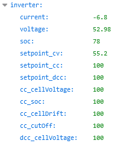

# REST API Dokumentation

## Hinweise
- Alle Endpunkte liefern JSON-Daten zurück.
- Die API benötigt keine Authentifizierung.

## Endpunkte

### 1. Systemdaten [GET]
Endpunkt: `/restapi`

**Beschreibung:**
Dieser Endpunkt ermöglicht das Abrufen verschiedener Systemdaten vom Controller. Die Antwort enthält Informationen über den Systemzustand, Daten, die an den Wechselrichter gesendet werden, sowie Daten der verbundenen Data-Devices.

**Antwortformat:**  
Dies ist nur ein Auszug aus der Antwort und nicht vollständig!
```json
{
  "system": {
    "fw_version": "T0.8.0_T9", 
    "fw_add": "SERIAL_LOG", 
    "hw_version": "2", 
    "name": "bsc", 
    "time": "2025-04-03 06:10:39", 
    "boottime": "2025-04-01 21:01:46", 
    "system": 0, 
    "mqtt": 0, 
    "rssi": 23},
  "trigger": {
    "0": 0, 
    "1": 1, 
    "2": 0, 
    "3": 0},
  "inverter": {
    "current": 66.30, 
    "voltage": 55.30, 
    "soc": 14},
  "data_device": [
    {"name": "NEEY 1", "cells": 18, "totalVolt": 0.00, "totalCurr": 0.00, "soc": 0},
    {"name": "Seplos 1", "cells": 18, "totalVolt": 55.30, "totalCurr": 22.10, "soc": 85}
  ]
}
```

### 2. Alle Active-Errors [GET] 
> Hinweis: Dieser Endpunkt ist nur in der [Supporter Version](supporter.md) verfügbar.

Endpunkt: `/restapi/errors/all`

**Beschreibung:**
Dieser Endpunkt gibt alle möglichen Fehler des Systems zurück, inklusive einer Kennzeichnung, ob sie derzeit aktiv sind oder nicht.

**Antwortformat:**
```json
{
  "errors": [
    {"id": 1, "state": false, "text": "Data Device 0 Error"},
    {"id": 2, "state": false, "text": "Data Device 1 Error"},
    {"id": 20, "state": false, "text": "CANBUS Error"}
  ]
}
```

### 3. Aktive Active-Errors [GET]
> Hinweis: Dieser Endpunkt ist nur in der [Supporter Version](supporter.md) verfügbar.

Endpunkt: `/restapi/errors/active`

**Beschreibung:**
Dieser Endpunkt gibt nur die aktuell aktiven Active-Errors des Systems zurück. Das Format ist identisch mit `/restapi/errors/all`, enthält aber nur Einträge mit `"state": true`.

**Antwortformat:**
```json
{
  "errors": [
    {"id": 20, "state": true, "text": "CANBUS Error"}
  ]
}
```

### 4. IO-Daten [GET]
> Hinweis: Dieser Endpunkt ist nur in der [Supporter Version](supporter.md) verfügbar.

Endpunkt: `/restapi/io`

**Beschreibung:**
Dieser Endpunkt gibt den Zustand der digitalen Eingänge (DI) und Relais zurück.

**Antwortformat:**
```json
{
  "di": [0, 0, 0, 0],
  "relais": [0, 0, 0, 0, 0, 0]
}
```

### 5. vTrigger [POST]
> Hinweis: Dieser Endpunkt ist nur in der [Supporter Version](supporter.md) verfügbar.

Endpunkt: `/restapi/vTrigger`

**Beschreibung:**
Dieser Endpunkt erlaubt das Setzen der virtuellen Trigger.

**Erwartetes Eingabeformat:**
```json
{
  "id": [Trigger Nr],
  "value": [0|1]
}
```

**Beispielaufruf mit `curl`**:  
Windows:  
```bash
curl -L -X POST "http://[BSC IP]/restapi/vTrigger" ^
-H "Content-Type: application/json" ^
-d "{\"id\":6,\"value\":0}"
```

Linux:  
```bash
curl -L -X POST "http://[BSC IP]/restapi/vTrigger" \
-H "Content-Type: application/json" \
-d "{\"id\":6,\"value\":0}"
```

## Derzeit aktive Inverter-Drosselung
Welche eingestellte Drosselung gerade aktiv ist, können Sie mit Hilfe der Restapi einsehen.  
Hierzu nach der IP-Adresse des BSC "/restapi" hinzufügen (z.B. 192.168.1.100/restapi).  

Die dargestellten "cc_"-Werte und "dcc_"-Werte stellen den durch die jeweilige Laderegelung limitierten Strom dar.

{ width="250" }  

Falls es nicht möglich ist, die Daten während eines Drosselungs-Events direkt anzuzeigen, besteht die Möglichkeit, diese temporär über eine alternative Plattform wie Home Assistant aufzeichnen zu lassen. Dabei ist zu beachten, dass jede Abfrage der REST-API alle verfügbaren Daten umfasst.

Für die Übertragung der Daten kann mit einer Dauer von etwa 0,5 bis 1 Sekunde pro Paket gerechnet werden. Diese Zeitangabe dient als Orientierung.

Nachfolgend finden Sie ein Beispiel für einen YAML-Code, der für die Erstellung eines Sensors zur Anzeige des Werts von "setpoint_cc" in Home Assistant verwendet werden kann:

```yaml
platform: rest
name: bscapi_setpoint_cc
resource: http://192.x.x.x/restapi
value_template: "{{ value_json['inverter']['setpoint_cc'] }}"
unit_of_measurement: "A"
state_class: "measurement"
icon: "mdi:api"
```

