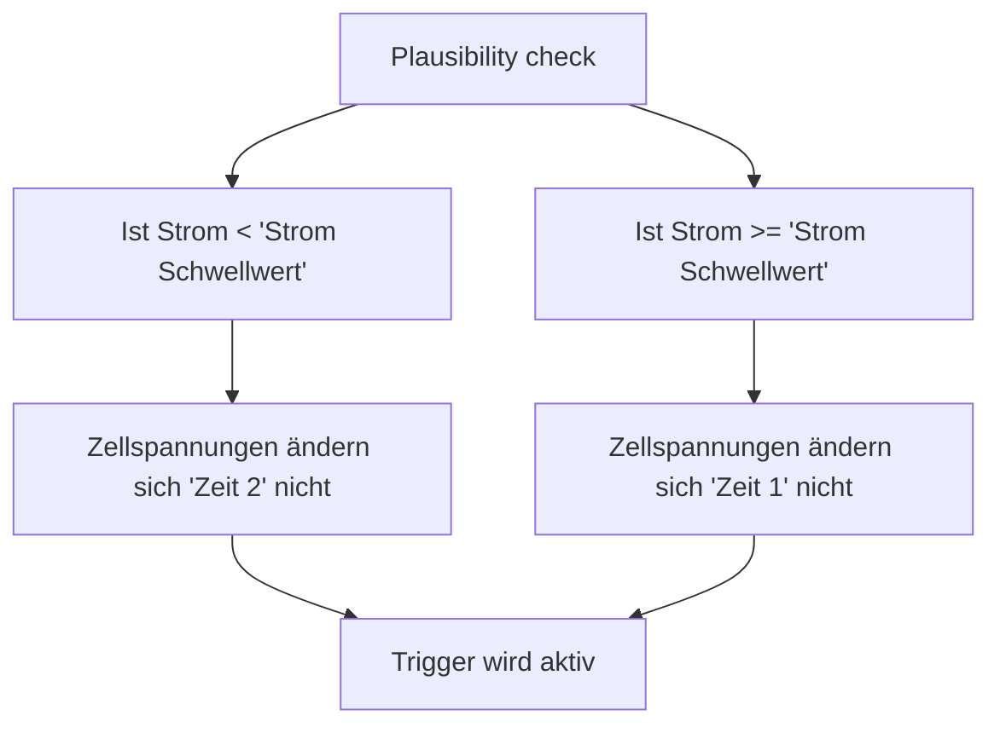

# Alarmregeln 
In den Alarmregeln kann eingestellt werden, welche Daten von welchen Devices überwacht werden sollen.  

## BMS
Die BMS Alarmregeln ermöglichen die Überwachung der konfigurierten Data-Devices. Es können verschiedene Parameter des Data-Device überwacht werden, um Alarme zu konfigurieren und automatische Aktionen auszulösen, wenn bestimmte Schwellenwerte erreicht werden.

```bsc-settings
version: v010
file: alarmBms.json
profile: off
groups: 1
index: 1
```

Es stehen **10 BMS-Alarmregeln** zur Verfügung. Pro Alarmregel:

**Zu überwachendes Data-Device**  
Hier wird festgelegt, für welches Data-Device die Alarmregel gilt.

**Keine Daten vom BMS**  
Überwacht, ob vom zugeordneten Data-Device über einen definierten Zeitraum keine Daten empfangen werden.

- **Aktion bei Trigger**  
  Auswahl des Triggers (Trigger 1–27), der bei Auslösen der Bedingung aktiviert werden soll.
- **Trigger keine Daten (s)**  
  Zeit in Sekunden, nach deren Ablauf ohne eingehende Daten der Trigger aktiviert wird.

**Spannungsüberwachung Zelle Min/Max**  
Überwacht die minimalen und maximalen Spannungswerte der einzelnen Zellen.

- **Aktion bei Trigger**  
  Auswahl des Triggers (Trigger 1–27), der bei Auslösen der Bedingung aktiviert werden soll.
- **Anzahl Zellen Monitoring**  
  Anzahl der zu überwachenden Zellen.
- **Zellspannung Min (mV)**  
  Unterer Grenzwert der Zellspannung (Standard 2500 mV).  
  Wird dieser unterschritten, löst die Alarmregel aus.
- **Zellspannung Max (mV)**  
  Oberer Grenzwert der Zellspannung (Standard 3650 mV).  
  Wird dieser überschritten, löst die Alarmregel aus.
- **Hysterese Min/Max (mV)**  
  Definiert den Spannungsbereich, um den sich die Spannung bei aktivem Trigger mindestens verändern muss, damit der erkannte Fehler wieder zurückgesetzt wird.
  Beispiel: Wird der Trigger bei einer Zellspannung Max. von 3,65 V ausgelöst und die Hysterese ist auf 50 mV eingestellt, muss die Spannung unter 3,60 V fallen, damit der Trigger wieder deaktiviert wird.

**Spannungsüberwachung Gesamt Min/Max**  
Überwacht die minimalen und maximalen Spannungswerte des gesamten Systems.

- **Aktion bei Trigger**  
  Auswahl des Triggers (Trigger 1–27), der bei Auslösen der Bedingung aktiviert werden soll.
- **Spannung Min (V)**  
  Unterer Grenzwert der Gesamtspannung (Standard 48,00 V).
- **Spannung Max (V)**  
  Oberer Grenzwert der Gesamtspannung (Standard 54,00 V).
- **Hysterese Min/Max (V)**  
  Definiert den Spannungsbereich, um den sich die Spannung bei aktivem Trigger mindestens verändern muss, damit der erkannte Fehler wieder zurückgesetzt wird.  


## Plausibility check
### Plausibility check

!!! note "Hinweis zur Supporter-Firmware"
    Der Plausibility Check ist auch Bestandteil der **Supporter-Firmware**. Weitere Informationen: [Supporter](supporter.md).

Der "Plausibility Check" ist eine wichtige Funktion, die kontinuierlich den Stromfluss sowie die Zellspannungen der an das System angeschlossenen Data-Devices überwacht.  

Wenn sich die Werte für Strom und Zellspannungen über einen längeren Zeitraum hinweg nicht mehr regelmäßig ändern, deutet dies darauf hin, dass das BMS keine gültigen Daten mehr sendet. In diesem Fall kann davon ausgegangen werden, dass ein Problem im BMS vorliegt.

Der "Plausibility Check" bietet so eine frühzeitige Warnung bei Unregelmäßigkeiten und unterstützt die zuverlässige Funktion und Sicherheit des gesamten Systems.  

**Funktionsweise des Plausibility checks**:



**Parameter:**

```bsc-settings
version: v010
file: plausibilityCheck.json
profile: off
section: UI_SECT_PLAUSIBILITYCHECK_PLAUSIBILITY_CHECK
```

**Cellvoltage plausibility check**  
Hier kann eingestellt werden, **welcher Trigger aktiviert wird**, falls ein Fehler bei der Plausibilitätsprüfung der Zellspannungen erkannt wird.  
Der Trigger sorgt dafür, dass im Fehlerfall entsprechende Aktionen ausgelöst werden, z. B. Alarmmeldungen oder Schutzmaßnahmen.

**Zu überwachende Geräte**  
Hier werden die Data Devices ausgewählt, deren Zellspannungen geprüft werden sollen.  

**Strom-Schwellwert (A)**  
Definiert den Grenzwert für den Batteriestrom, ab dem unterschiedliche Prüfzeiten (*Zeit 1* oder *Zeit 2*) angewendet werden (Standard: 200 A).  

**Zeit 1 (s)**  
Wird verwendet, wenn der Strom im Batterypack **größer** als der eingestellte *Strom-Schwellwert* ist (Standard: 30 s).  
Diese Zeit legt fest, wie lange ein auffälliger Zellspannungswert bestehen muss, bevor er als fehlerhaft gewertet wird.  

**Zeit 2 (s)**  
Wird verwendet, wenn der Strom im Batterypack **kleiner oder gleich** dem eingestellten *Strom-Schwellwert* ist (Standard: 240 s).  
In der Regel wird hier eine längere Zeit eingestellt, um Fehlalarme bei geringen Lasten zu vermeiden.


### Wertevergleich

!!! note "Hinweis zur Supporter-Firmware"
    Der Wertevergleich ist auch Bestandteil der **Supporter-Firmware**. Weitere Informationen: [Supporter](supporter.md).

Mit dieser Funktion können die Werte ausgewählter Data Devices überwacht und miteinander verglichen werden. Bei Überschreiten der definierten Abweichungen wird der zugewiesene Trigger aktiviert.  
Es stehen **10 Wertevergleichs-Regeln** zur Verfügung.

```bsc-settings
version: v010
file: plausibilityCheck.json
profile: off
groups: 1
section: UI_SECT_PLAUSIBILITYCHECK_WERTEVERGLEICH
```

**Trigger**  
Hier kann ausgewählt werden, welcher Trigger (Trigger 1–27) ausgelöst werden soll, wenn eine Abweichung erkannt wird.  

**Vergleichen**  
Wählen Sie die Data Devices aus, deren Werte miteinander verglichen werden sollen.  

**Werte**  
Legt fest, welche Werte verglichen werden:  

- **Gesamtspannung**  
- **Zellspannung**  
- **Batteriestrom**  
  Zusätzlich wird überwacht, dass bei einem offenen Lade-FET nur ein Ladestrom von maximal **100 mA** fließen darf.  
  Die 100 mA dienen als Toleranz aufgrund von Messungenauigkeiten.  
  Das Gleiche gilt auch für den Entlade-FET, jedoch in umgekehrter Stromrichtung.

**Maximale Abweichung**  

- **Gesamtspannung (mV)**  
  Die maximal zulässige Abweichung der Gesamtspannung zwischen den ausgewählten Geräten (Standard: 50 mV).  
- **Zellspannung (mV)**  
  Die maximal zulässige Abweichung der einzelnen Zellspannungen (Standard: 5 mV).  
- **Batteriestrom (A)**  
  Die maximal zulässige Abweichung des Batteriestroms (Standard: 5 A).  

**Verzögerung (s)**  
Definiert die Zeitspanne, die die Abweichung bestehen muss, bevor der Trigger ausgelöst wird (Standard: 5 s). Dies verhindert Fehlalarme durch kurzzeitige Schwankungen.  

---

**Einsatzbeispiele:**  

- Prüfen, ob sich der Batteriestrom gleichmäßig zwischen den ausgewählten **Data Devices** aufteilt.  
- Prüfen, ob die Zellspannungen zwischen zwei in einem Batteriepack verbauten Geräten, z. B. einem **BMS** und einem **Balancer** gleich sind.

**Hinweis:**  
Der Wertevergleich prüft nicht, ob die **Data Devices** tatsächlich online sind. Diese Überwachung kann an anderer Stelle erfolgen und entsprechend darauf reagiert werden.  


### Zellspannung bei Ladestrom

Diese Überwachung beruht auf einer einfachen Plausibilitätsregel: **Wird die Batterie gerade geladen, dürfen die Zellspannungen nicht fallen.** Während eines aktiven Ladevorgangs mit ausreichendem Ladestrom sollten die Zellspannungen stabil bleiben oder steigen. Sinkt die Spannung einer Zelle trotzdem reproduzierbar ab, ist das ein Hinweis auf ein Problem, zum Beispiel:

- eine schwache oder defekte Zelle,
- einen lockeren oder korrodierten Zellverbinder bzw. Messkontakt,
- auffällige Messwerte des BMS während des Ladens.

Die Überwachung prüft dabei keine festen Spannungsgrenzen, sondern die **Spannungsrichtung im Verhältnis zum Ladestrom**. Zur Abgrenzung zu den normalen Min/Max-Alarmen siehe [unten](#abgrenzung-zu-den-minmax-alarmen).

```bsc-settings
version: v010
file: plausibilityCheck.json
profile: off
section: 2
```

#### So funktioniert die Erkennung

**Ladefenster und Mindest-Ladestrom**  
Die Auswertung läuft nur, solange das überwachte Data-Device mit mindestens **5 A** geladen wird. Bei geringerem Ladestrom (oder bei Entladung) ist ein Spannungsabfall nicht aussagekräftig und wird nicht bewertet. Sobald der Ladestrom über der Schwelle liegt, startet ein Ladefenster. Erst nach **30 Sekunden** ununterbrochen gültigem Ladefenster kann ein erkannter Einbruch überhaupt einen Alarm auslösen – so werden Einschwingvorgänge direkt nach Ladestart ignoriert. Fällt der Ladestrom unter 5 A, wird das Ladefenster verworfen; der nächste Ladevorgang beginnt mit komplett frischen Referenzwerten.

**Referenzspannung pro Zelle**  
Für jede Zelle baut die Überwachung während des Ladens eine Referenzspannung auf – das bisher beste Spannungsniveau dieser Zelle. Die Referenz entsteht nicht aus einem einzelnen Messwert, sondern aus dem **Median von 5 aufeinanderfolgenden Messwerten**. Steigt die Zellspannung im weiteren Verlauf, wird die Referenz ebenfalls erst nach 5 Messwerten oberhalb der bisherigen Referenz angehoben (wieder als Median). Die Referenz wird **nie gesenkt**: Ein fallender Messwert zieht die Referenz also nicht nach unten, sondern wird als möglicher Einbruch gewertet.

**Einbruch bestätigen**  
Liegt eine Zellspannung um **mehr als 5 mV** unter ihrer Referenz, gilt das als möglicher Einbruch. Ein einzelner niedriger Messwert löst noch nichts aus: Der Einbruch muss in **3 aufeinanderfolgenden Messungen** bestätigt werden und das Ladefenster mindestens 30 Sekunden alt sein. Messwerte innerhalb der 5-mV-Toleranz oder oberhalb der Referenz setzen den Bestätigungszähler wieder zurück. Einzelne Ausreißer und das übliche Zellspannungsrauschen bleiben dadurch ohne Folgen.

**Trigger setzen und Alarmmeldung**  
Ist ein Einbruch bestätigt, setzt die Alarmregel im Sekundentakt den ausgewählten Trigger. Die Alarmmeldung zeigt Device, Zelle sowie aktuelle und Referenzspannung, zum Beispiel `D0 C3, 3302/3310 mV` (Device 0, Zelle 3: 3302 mV statt 3310 mV). Haben mehrere Zellen gleichzeitig eingebrochen, wird pro Device die Zelle mit dem größten Einbruch festgehalten. Der Trigger bleibt aktiv, solange mindestens ein überwachtes Device einen bestätigten Einbruch hat.

**Hysterese und automatisches Rücksetzen**  
Ohne die Option „Fehler bis manuellem Reset halten“ wird der Fehler automatisch zurückgesetzt, sobald sich alle Zellen erholt haben: Liegt keine Zelle mehr um mehr als 5 mV unter ihrer Referenz und bleibt dieser Zustand **60 Sekunden** lang stabil, wird der Fehler gelöscht und der Trigger zurückgesetzt. Dasselbe gilt, wenn der Ladestrom länger als 60 Sekunden unter 5 A bleibt. Die 60-Sekunden-Rückstellzeit verhindert, dass kurzzeitige Messwertschwankungen den Alarm ständig flackern lassen.

**Fehler bis manuellem Reset halten**  
Ist diese Option aktiviert, bleibt ein einmal erkannter Fehler dauerhaft bestehen – auch wenn sich die Zellspannung erholt hat oder die Ladung beendet ist. Der Trigger bleibt dann aktiv, bis der Fehler in der WebApp (Expert Actions, „Manuelle Aktionen“, Button **Reset** bei „Zellspannungsabfall zurücksetzen“) manuell gelöscht wird. Danach beginnt die Überwachung beim nächsten Ladevorgang wieder mit neuen Referenzwerten. Wird die Überwachung selbst ausgeschaltet, wird der Trigger in jedem Fall zurückgesetzt.

#### Voraussetzungen

Überwacht werden ausschließlich Data-Devices (Group Devices werden nicht unterstützt). Ein Device wird nur dann ausgewertet, wenn alle folgenden Bedingungen erfüllt sind:

- Die Überwachung ist eingeschaltet und ein Trigger ist ausgewählt.
- Das Device ist unter „Zu überwachende Geräte“ ausgewählt.
- Das Device ist als BMS erkannt – Balancer und Shunts werden nicht ausgewertet.
- Das Device befindet sich nicht im Wartungsmodus.
- Die Zellanzahl des BMS ist gültig (1–24 Zellen) und mindestens eine Zellspannung wird geliefert.
- Es fließt ein Ladestrom von mindestens 5 A.

#### Parameter

**Ein/Aus**  
Schaltet die Überwachung ein (Standard: **Aus**).

**Zu überwachende Geräte**  
Data-Devices, deren Zellspannungen überwacht werden sollen (Standard: **keine**).

**Trigger**  
Trigger (Trigger 1–27), der bei einem bestätigten Einbruch gesetzt wird (Standard: **Aus**). Erst wenn hier ein Trigger gewählt ist, ist die Überwachung aktiv.

**Fehler bis manuellem Reset halten**  
Ist die Option aktiviert (Standard: **Aus**), bleibt ein erkannter Fehler bestehen, bis er in der WebApp manuell zurückgesetzt wird (siehe oben).

Die Erkennungsschwellen selbst (5 A Mindest-Ladestrom, 30 s Ladefenster, 5 mV Einbruch, 3 Bestätigungen, 60 s Rückstellzeit) sind fest eingestellt und nicht konfigurierbar.

#### Beispielablauf

!!! example "Beispiel mit den internen Standardwerten"
    1. Um 10:00 Uhr beginnt die Ladung mit **20 A**. Der Ladestrom liegt über 5 A, das Ladefenster startet.
    2. Zelle 3 liefert nacheinander **3300, 3301, 3300, 3302, 3301 mV**. Der Median dieser 5 Messwerte ist **3301 mV** – die Referenzspannung dieser Zelle.
    3. Die Zellspannung steigt im weiteren Verlauf. Nach 5 Messwerten oberhalb der bisherigen Referenz wird diese angehoben; der Median der 5 Werte ergibt die neue Referenz **3310 mV**.
    4. Um 10:05 Uhr (Ladefenster längst über 30 Sekunden) bricht die Zelle ein: **3304 mV** (6 mV unter Referenz) → erste Bestätigung, **3303 mV** (7 mV) → zweite, **3302 mV** (8 mV) → dritte. Der Einbruch ist bestätigt, der Trigger wird gesetzt. Die Alarmmeldung lautet `D0 C3, 3302/3310 mV`.
    5. Die Zelle erholt sich wieder auf Werte von mindestens 3305 mV. Nach **60 Sekunden** ohne bestätigten Einbruch wird der Fehler gelöscht und der Trigger zurückgesetzt. Mit aktivierter Option „Fehler bis manuellem Reset halten“ bliebe der Trigger dagegen aktiv.

#### Abgrenzung zu den Min/Max-Alarmen

Die normalen Min/Max-Alarme ([BMS-Alarmregeln](#bms)) vergleichen jede Zellspannung mit festen, absoluten Grenzwerten (z. B. 2500 mV und 3650 mV) – unabhängig davon, ob gerade geladen wird. Sie erkennen Über- und Unterspannung.

Die Überwachung „Zellspannung bei Ladestrom“ arbeitet dagegen **relativ**: Sie vergleicht die Zellspannung mit der eigenen, während der Ladung aufgebauten Referenz. Dadurch erkennt sie auch kleine Einbrüche von wenigen Millivolt weit oberhalb der Min-Schwelle – ein typisches Frühwarnzeichen für einen beginnenden Zell- oder Kontaktfehler, das die Min/Max-Alarme erst bemerken würden, wenn die Spannung tief gefallen ist. Die Funktion ist außerdem nur während des Ladens mit mindestens 5 A aktiv.

#### Hinweise zur Bewertung

Ein erkannter Einbruch ist kein sicherer Beweis für eine defekte Zelle. Prüfe bei einem Alarm zuerst:

- Tritt der Fehler wiederholt bei derselben Zelle auf?
- Sind Zellverbinder und Messleitungen in Ordnung?
- Zeigt das BMS selbst Warnungen oder Fehler?

Tritt der Einbruch wiederholt bei derselben Zelle auf, sollte diese Zelle bzw. ihre Verschaltung genauer geprüft werden.

Für die Fehlersuche können zusätzlich die Diagnosewerte der Überwachung über MQTT ausgegeben werden: Filteroption **„Zellspannungsabfall (Debug)“** (standardmäßig aus), Werte unter dem Topic `cell_sag`. Weitere Informationen: [MQTT](mqtt.md).


## Temperatur
### Alarm bei Onewire-Sensorfehler
In diesem Abschnitt können Alarme für Sensorfehler an den Onewire-Temperatursensoren konfiguriert werden.

```bsc-settings
version: v010
file: alarmTemp.json
profile: off
section: UI_SECT_ALARMTEMP_ALARM_BEI_SENSORFEHLER
```

**Trigger**  
Auswahl des Triggers (Trigger 1–27), der bei einem erkannten Sensorfehler aktiviert werden soll.  

**Timeout (s)**  
Zeit in Sekunden, nach deren Ablauf ohne gültige Sensordaten der Alarm ausgelöst wird (5–240 s, Standard 5 s).  
Dies dient dazu, kurzzeitige Aussetzer zu tolerieren und Fehlalarme zu vermeiden.


### Temperatur Überwachung
Die Temperatur-Überwachung dient dazu, definierte Sensoren kontinuierlich zu kontrollieren und bei Überschreiten oder Unterschreiten bestimmter Grenzwerte Alarme bzw. Trigger auszulösen. Dies kann sowohl für Data-Device-integrierte Sensoren als auch für erweiterte Sensoren (z. B. OneWire) erfolgen.  
Es stehen **10 Temperaturregeln** zur Verfügung.

```bsc-settings
version: v010
file: alarmTemp.json
profile: off
groups: 1
section: UI_SECT_ALARMTEMP_TEMPERATUR_220_BERWACHUNG
```

**Quelle**  
Legt fest, von welchem Sensortyp die Messwerte stammen:

- **Data Device** – Auswahl von 0–5 internen BMS-Sensoren.
- **Data Device – Erweiterte Sensoren** – Auswahl von 0–31 erweiterten Sensoren (z. B. OneWire).
- **Group Device** / **Group Device – Erweiterte Sensoren** – nur verfügbar, wenn [Group Devices](settings_bsc_group-devices.md#group-devices-batterie-gruppen) aktiviert sind.

**Zu überwachende Quellen**  
Hier kann festgelegt werden, von welchem **Data-Device** (bzw. Group Device) die Temperaturdaten stammen sollen.  

**Sensoren**  
Hier können die Sensoren gewählt werden, deren Werte für die Überwachung relevant sind.  
Welche Sensoren angeboten werden, hängt von der gewählten Quelle ab (BMS-Sensoren 0–5 bzw. erweiterte Sensoren 0–31).

**Überwachungstyp**  
Bestimmt die Logik, nach der die Temperaturwerte überwacht werden:

- **Maximalwert-Überschreitung:** Alarm bei Überschreiten von Wert 1.
- **Minimalwert-Unterschreitung:** Alarm bei Unterschreiten von Wert 1.
- **Maximalwert-Überschreitung (Referenz):**  
  Überwacht, dass keine der Temperaturen der Ausgewählten *Sensoren*  mehr als den zulässigen Temperaturoffset (*Wert 1)* von dem unter *Referenzsensor* definierten Sensor abweicht.  
  Der *Referenzsensor* ist die Sensornummer des Temperatursensors, gegen den Verglichen wird.  
  Wert 1 definiert den zulässigen Temperatur-Offset.
- **Differenzwert-Überwachung:**  
  Überwacht die maximale Differenz zwischen den unter *Sensoren* ausgewählten Temperatursensoren. Ist die Differenz zwischen dem niedrigsten und höchsten Wert zu groß, wird der Trigger ausgelöst.  
  *Wert 1* ist die maximal erlaubte Differenz.

**Referenzsensor**  
Gibt an, welcher Sensor als Referenzsensor verwendet wird (0–255).  
Nur relevant bei *Maximalwert-Überschreitung (Referenz)*.

**Wert 1**  
Numerischer Wert (−20 °C bis +100 °C) für den gewählten Überwachungstyp:

**Hysterese**  
Numerischer Wert (−20 °C bis +100 °C), der definiert, um wie viel der Messwert nach Unterschreiten des Schwellwerts fallen bzw. nach Überschreiten steigen muss, bevor die Überwachung wieder deaktiviert wird.  
Dies verhindert ständiges Ein- und Ausschalten bei Werten nahe am Grenzbereich.

**Auslösung**  
Bestimmt, welcher **Trigger** (Trigger 1–27) bei Eintreten der Überwachungsbedingung aktiviert wird.

---

**Beispiel**  

- Quelle: **Data Device – Erweiterte Sensoren**
- Sensor: **Nr. 12**
- Überwachung: **Maximalwert-Überschreitung**
- Wert 1: **60,00 °C**
- Hysterese: **2,00 °C**
- Auslösung: **Trigger 2**

**Ergebnis**  
Wenn der Sensor Nr. 12 eine Temperatur von 60,00 °C überschreitet, wird **Trigger 2** aktiviert. Erst wenn die Temperatur wieder unter 58,00 °C fällt (Wert 1 − Hysterese), wird der Trigger zurückgesetzt.
