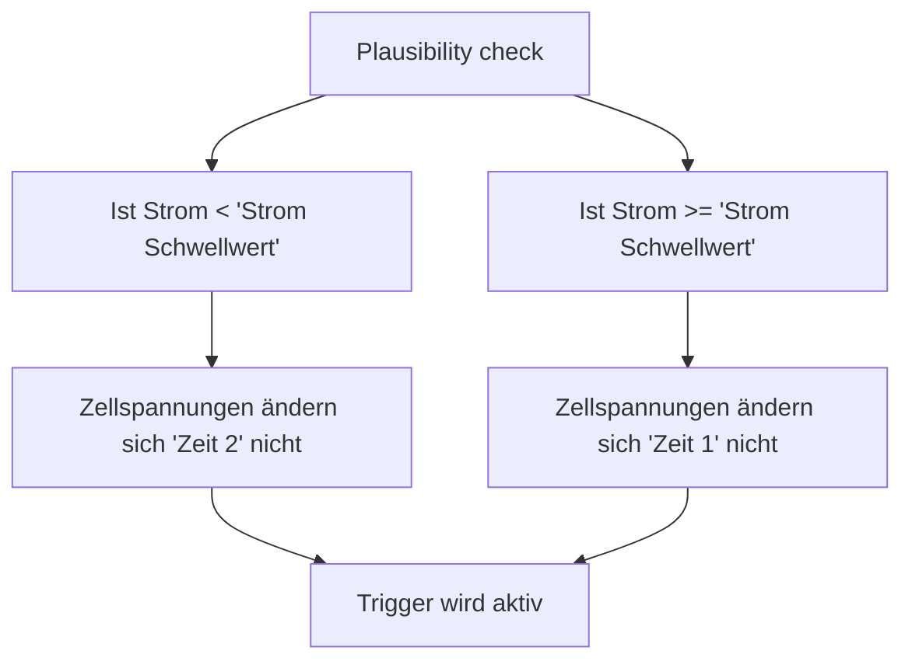

# Alarmregeln

In den Alarmregeln kann eingestellt werden, welche Daten von welchen Devices überwacht werden sollen.  

## BMS

Die BMS Alarmregeln ermöglichen die Überwachung der konfigurierten Data-Devices. Es können verschiedene Parameter des Data-Device überwacht werden, um Alarme zu konfigurieren und automatische Aktionen auszulösen, wenn bestimmte Schwellenwerte erreicht werden.

**Zu überwachendes Data-Device**  

<form><table>
<tr class="Ctr"><td class="Ctd"><b>Zu überwachendes Data device</b></td>
<td class="Ctd">
<input id="t303522607" class="toggle" type="checkbox">
<label for="t303522607" class="lbl-toggle">Zu überwachendes Data device</label>

<fieldset style="text-align:left;">
<input type="checkbox" name="21474837056" value="0">Data device 0 
<input type="checkbox" name="21474837056" value="1">Data device 1 
<input type="checkbox" name="21474837056" value="2">Data device 2 
<input type="checkbox" name="21474837056" value="3">Data device 3 
<input type="checkbox" name="21474837056" value="4">Data device 4 
<input type="checkbox" name="21474837056" value="5">Data device 5 
<input type="checkbox" name="21474837056" value="6">Data device 6 
<input type="checkbox" name="21474837056" value="7">Data device 7 
<input type="checkbox" name="21474837056" value="8">Data device 8 
<input type="checkbox" name="21474837056" value="9">Data device 9 
<input type="checkbox" name="21474837056" value="10">Data device 10 
<input type="checkbox" name="21474837056" value="11">Data device 11 
<input type="checkbox" name="21474837056" value="12">Data device 12 
<input type="checkbox" name="21474837056" value="13">Data device 13 
<input type="checkbox" name="21474837056" value="14">Data device 14 
<input type="checkbox" name="21474837056" value="15">Data device 15 
<input type="checkbox" name="21474837056" value="16">Data device 16 
<input type="checkbox" name="21474837056" value="17">Data device 17 
</fieldset>

</td><td class="t1"></td></tr>
</table></form>

Hier wird festgelegt, für welches Data-Device die Alarmregel gilt.

---

**Keine Daten vom BMS**  
Überwacht, ob vom zugeordneten Data-Device über einen definierten Zeitraum keine Daten empfangen werden.

<form><table>
<tr class="Ctr"><td class="sep" colspan="3"><a href="https://bsc-org.github.io/bsc/settings_bsc/#alarmregeln" target="_blank"><b>Keine Daten vom BMS</b></a></td></tr>
<tr class="Ctr"><td class="Ctd"><b>Aktion bei Trigger</b></td>
<td class="Ctd"><select name="4294968384">
<option value="0" selected="">Aus</option>
<option value="1">Trigger 1 </option>
<option value="2">Trigger 2 </option>
<option value="3">Trigger 3 </option>
<option value="4">Trigger 4 </option>
<option value="5">Trigger 5</option>
<option value="6">Trigger 6</option>
<option value="7">Trigger 7</option>
<option value="8">Trigger 8</option>
<option value="9">Trigger 9</option>
<option value="10">Trigger 10</option>
</select></td><td class="t1"></td><td class="Ctd"></td></tr>
<tr class="Ctr"><td class="Ctd"><b>Trigger keine Daten</b></td>
<td class="Ctd"><input type="number" min="1" max="255" value="15" name="4294968064"></td><td class="t1">s</td><td class="Ctd"></td></tr>
</table></form>

- **Aktion bei Trigger**  
  Auswahl des Triggers, der bei Auslösen der Bedingung aktiviert werden soll.
- **Trigger keine Daten (s)**  
  Zeit in Sekunden, nach deren Ablauf ohne eingehende Daten der Trigger aktiviert wird.

---

**Spannungsüberwachung Zelle Min/Max**  
Überwacht die minimalen und maximalen Spannungswerte der einzelnen Zellen.

<form><table>
<tr class="Ctr"><td class="sep" colspan="3"><b>Spannungsüberwachung Zelle Min/Max</b></td></tr>
<tr class="Ctr"><td class="Ctd"><b>Aktion bei Trigger</b></td>
<td class="Ctd"><select name="4294968448">
<option value="0" selected="">Aus</option>
<option value="1">Trigger 1 </option>
<option value="2">Trigger 2 </option>
<option value="3">Trigger 3 </option>
<option value="4">Trigger 4 </option>
<option value="5">Trigger 5</option>
<option value="6">Trigger 6</option>
<option value="7">Trigger 7</option>
<option value="8">Trigger 8</option>
<option value="9">Trigger 9</option>
<option value="10">Trigger 10</option>
</select></td><td class="t1"></td><td class="Ctd"></td></tr>
<tr class="Ctr"><td class="Ctd"><b>Anzahl Zellen Monitoring</b></td>
<td class="Ctd"><input type="number" min="1" max="24" value="16" name="4294968192"></td><td class="t1"></td><td class="Ctd"></td></tr>
<tr class="Ctr"><td class="Ctd"><b>Zellspannung Min</b></td>
<td class="Ctd"><input type="number" min="0" max="5000" value="2500" name="12884902848"></td><td class="t1">mV</td><td class="Ctd"></td></tr>
<tr class="Ctr"><td class="Ctd"><b>Zellspannung Max</b></td>
<td class="Ctd"><input type="number" min="0" max="5000" value="3550" name="12884902912"></td><td class="t1">mV</td><td class="Ctd"></td></tr>
<tr class="Ctr"><td class="Ctd"><b>Hysterese Min/Max</b></td>
<td class="Ctd"><input type="number" min="0" max="3000" value="50" name="12884912512"></td><td class="t1">mV</td><td class="Ctd"></td></tr>
</table></form>

- **Aktion bei Trigger**  
  Auswahl des Triggers, der bei Auslösen der Bedingung aktiviert werden soll.
- **Anzahl Zellen Monitoring**  
  Anzahl der zu überwachenden Zellen.
- **Zellspannung Min (mV)**  
  Unterer Grenzwert der Zellspannung.  
  Wird dieser unterschritten, löst die Alarmregel aus.
- **Zellspannung Max (mV)**  
  Oberer Grenzwert der Zellspannung.  
  Wird dieser überschritten, löst die Alarmregel aus.
- **Hysterese Min/Max (mV)**  
  Definiert den Spannungsbereich, um den sich die Spannung bei aktivem Trigger mindestens verändern muss, damit der erkannte Fehler wieder zurückgesetzt wird.
  Beispiel: Wird der Trigger bei einer Zellspannung Max. von 3,55 V ausgelöst und die Hysterese ist auf 50 mV eingestellt, muss die Spannung unter 3,50 V fallen, damit der Trigger wieder deaktiviert wird.

---

**Spannungsüberwachung Gesamt Min/Max**  
Überwacht die minimalen und maximalen Spannungswerte des gesamten Systems.

<form><table>
<tr class="Ctr"><td class="sep" colspan="3"><b>Spannungsüberwachung Gesamt Min/Max</b></td></tr>
<tr class="Ctr"><td class="Ctd"><b>Aktion bei Trigger</b></td>
<td class="Ctd"><select name="4294968512">
<option value="0" selected="">Aus</option>
<option value="1">Trigger 1 </option>
<option value="2">Trigger 2 </option>
<option value="3">Trigger 3 </option>
<option value="4">Trigger 4 </option>
<option value="5">Trigger 5</option>
<option value="6">Trigger 6</option>
<option value="7">Trigger 7</option>
<option value="8">Trigger 8</option>
<option value="9">Trigger 9</option>
<option value="10">Trigger 10</option>
</select></td><td class="t1"></td><td class="Ctd"></td></tr>
<tr class="Ctr"><td class="Ctd"><b>Spannung Min</b></td>
<td class="Ctd"><input type="number" step="0.01" min="0" max="66" value="48.00" name="30064775680"></td><td class="t1">V</td><td class="Ctd"></td></tr>
<tr class="Ctr"><td class="Ctd"><b>Spannung Max</b></td>
<td class="Ctd"><input type="number" step="0.01" min="0" max="66" value="54.00" name="30064775744"></td><td class="t1">V</td><td class="Ctd"></td></tr>
<tr class="Ctr"><td class="Ctd"><b>Hysterese Min/Max</b></td>
<td class="Ctd"><input type="number" step="0.01" min="0" max="10" value="0.50" name="30064779456"></td><td class="t1">V</td><td class="Ctd"></td></tr>
</table></form>

- **Aktion bei Trigger**  
  Auswahl des Triggers, der bei Auslösen der Bedingung aktiviert werden soll.
- **Spannung Min (V)**  
  Unterer Grenzwert der Gesamtspannung.
- **Spannung Max (V)**  
  Oberer Grenzwert der Gesamtspannung.
- **Hysterese Min/Max (V)**  
  Definiert den Spannungsbereich, um den sich die Spannung bei aktivem Trigger mindestens verändern muss, damit der erkannte Fehler wieder zurückgesetzt wird.  

## Plausibility check

### Plausibility check

!!! note "Hinweis"
    Diese Funktion steht nur in der **Insider Version** zur Verfügung

Der "Plausibility Check" ist eine wichtige Funktion, die kontinuierlich den Stromfluss sowie die Zellspannungen der an das System angeschlossenen Data-Devices überwacht.  

Wenn sich die Werte für Strom und Zellspannungen über einen längeren Zeitraum hinweg nicht mehr regelmäßig ändern, deutet dies darauf hin, dass das BMS keine gültigen Daten mehr sendet. In diesem Fall kann davon ausgegangen werden, dass ein Problem im BMS vorliegt.

Der "Plausibility Check" bietet so eine frühzeitige Warnung bei Unregelmäßigkeiten und unterstützt die zuverlässige Funktion und Sicherheit des gesamten Systems.  

**Funktionsweise des Plausibility checks**:

**Parameter:**

<form><table>
<tr class='Ctr'><td class='sep' colspan='3'><b>Plausibility check</b></td></tr>
<tr class='Ctr'><td class='Ctd'><b>Cellvoltage plausibility check</b></td>
<td class='Ctd'><select name='4294975744'>
<option value='0' selected>Aus</option>
<option value='1' >Trigger 1 (DI1)</option>
<option value='2' >Trigger 2 (DI2)</option>
<option value='3' >Trigger 3 (DI3)</option>
<option value='4' >Trigger 4 (DI4)</option>
<option value='5' >Trigger 5</option>
<option value='6' >Trigger 6</option>
<option value='7' >Trigger 7</option>
<option value='8' >Trigger 8</option>
<option value='9' >Trigger 9</option>
<option value='10' >Trigger 10</option>
</select></td><td class='t1'></td><td class='Ctd'></td></tr>
<tr class='Ctr'><td class='Ctd'><b>Zu &uuml;berwachende Geräte</b></td>
<td class='Ctd'>
<input id='t304808059' class='toggle' type='checkbox'>
<label for='t304808059' class='lbl-toggle'>Zu &uuml;berwachende Geräte</label>

<fieldset style='text-align:left;'>
<input type='checkbox' name='21474847296' value='0' >Data device 0 
<input type='checkbox' name='21474847296' value='1' >Data device 1 
<input type='checkbox' name='21474847296' value='2' >Data device 2 
<input type='checkbox' name='21474847296' value='3' >Data device 3 
<input type='checkbox' name='21474847296' value='4' >Data device 4 
<input type='checkbox' name='21474847296' value='5' >Data device 5 
<input type='checkbox' name='21474847296' value='6' >Data device 6 
<input type='checkbox' name='21474847296' value='7' >Data device 7 
<input type='checkbox' name='21474847296' value='8' >Data device 8 
<input type='checkbox' name='21474847296' value='9' >Data device 9 
<input type='checkbox' name='21474847296' value='10' >Data device 10 
<input type='checkbox' name='21474847296' value='11' >Data device 11 
<input type='checkbox' name='21474847296' value='12' >Data device 12 
<input type='checkbox' name='21474847296' value='13' >Data device 13 
<input type='checkbox' name='21474847296' value='14' >Data device 14 
<input type='checkbox' name='21474847296' value='15' >Data device 15 
<input type='checkbox' name='21474847296' value='16' >Data device 16 
<input type='checkbox' name='21474847296' value='17' >Data device 17 
</fieldset>

</td><td class='t1'></td></tr>
<tr class='Ctr'><td class='Ctd'><b>Strom Schwellwert</b></td>
<td class='Ctd'><input type='number' step='0.01' min='1' max='65000' value='2.00' name='12884912768' class='fl2'></td><td class='t1'>A</td><td class='Ctd'></td></tr>
<tr class='Ctr'><td class='Ctd'><b>Zeit 1</b></td>
<td class='Ctd'><input type='number' min='1' max='7200' value='30' name='12884912832'></td><td class='t1'>s</td><td class='Ctd'></td></tr>
<tr><td colspan='3' class='td0'>
Wenn der Strom im Batterypack größer dem Stromschwellwert ist, dass wird diese Zeit für den P-Check genommen.
</td></tr><tr class='Ctr'><td class='Ctd'><b>Zeit 2</b></td>
<td class='Ctd'><input type='number' min='1' max='7200' value='240' name='12884912896'></td><td class='t1'>s</td><td class='Ctd'></td></tr>
<tr><td colspan='3' class='td0'>
Wenn der Strom im Batterypack kleiner dem Stromschwellwert ist, dass wird diese Zeit für den P-Check genommen.
</td>
</table></form>

**Cellvoltage plausibility check**  
Hier kann eingestellt werden, **welcher Trigger aktiviert wird**, falls ein Fehler bei der Plausibilitätsprüfung der Zellspannungen erkannt wird.  
Der Trigger sorgt dafür, dass im Fehlerfall entsprechende Aktionen ausgelöst werden, z. B. Alarmmeldungen oder Schutzmaßnahmen.

**Zu überwachende Geräte**  
Hier werden die Data Devices ausgewählt, deren Zellspannungen geprüft werden sollen.  

**Strom-Schwellwert (A)**  
Definiert den Grenzwert für den Batteriestrom, ab dem unterschiedliche Prüfzeiten (*Zeit 1* oder *Zeit 2*) angewendet werden.  

**Zeit 1 (s)**  
Wird verwendet, wenn der Strom im Batterypack **größer** als der eingestellte *Strom-Schwellwert* ist.  
Diese Zeit legt fest, wie lange ein auffälliger Zellspannungswert bestehen muss, bevor er als fehlerhaft gewertet wird.  

**Zeit 2 (s)**  
Wird verwendet, wenn der Strom im Batterypack **kleiner oder gleich** dem eingestellten *Strom-Schwellwert* ist.  
In der Regel wird hier eine längere Zeit eingestellt, um Fehlalarme bei geringen Lasten zu vermeiden.

### Wertevergleich

!!! note "Hinweis"
    Diese Funktion steht nur in der **[Insider Version](insider.md)** zur Verfügung

Mit dieser Funktion können die Werte ausgewählter Data Devices überwacht und miteinander verglichen werden. Bei Überschreiten der definierten Abweichungen wird der zugewiesene Trigger aktiviert.  

<form><table>
<tr class='Ctr'><td class='sep' colspan='3'><b>Wertevergleich</b></td></tr>
<tr class='Ctr'><td class='Ctd'><b>Trigger</b></td>
<td class='Ctd'><select name='4294979648'>
<option value='0' selected>Aus</option>
<option value='1' >Trigger 1 </option>
<option value='2' >Trigger 2 </option>
<option value='3' >Trigger 3 </option>
<option value='4' >Trigger 4 </option>
<option value='5' >Trigger 5</option>
<option value='6' >Trigger 6</option>
<option value='7' >Trigger 7</option>
<option value='8' >Trigger 8</option>
<option value='9' >Trigger 9</option>
<option value='10' >Trigger 10</option>
</select></td><td class='t1'></td><td class='Ctd'></td></tr>
<tr class='Ctr'><td class='Ctd'><b>Vergleichen</b></td>
<td class='Ctd'>
<input id='t304808301' class='toggle' type='checkbox'>
<label for='t304808301' class='lbl-toggle'>Vergleichen</label>

<fieldset style='text-align:left;'>
<input type='checkbox' name='21474848896' value='0' >Data device 0 
<input type='checkbox' name='21474848896' value='1' >Data device 1 
<input type='checkbox' name='21474848896' value='2' >Data device 2 
<input type='checkbox' name='21474848896' value='3' >Data device 3 
<input type='checkbox' name='21474848896' value='4' >Data device 4 
<input type='checkbox' name='21474848896' value='5' >Data device 5 
<input type='checkbox' name='21474848896' value='6' >Data device 6 
<input type='checkbox' name='21474848896' value='7' >Data device 7 
<input type='checkbox' name='21474848896' value='8' >Data device 8 
<input type='checkbox' name='21474848896' value='9' >Data device 9 
<input type='checkbox' name='21474848896' value='10' >Data device 10 
<input type='checkbox' name='21474848896' value='11' >Data device 11 
<input type='checkbox' name='21474848896' value='12' >Data device 12 
<input type='checkbox' name='21474848896' value='13' >Data device 13 
<input type='checkbox' name='21474848896' value='14' >Data device 14 
<input type='checkbox' name='21474848896' value='15' >Data device 15 
<input type='checkbox' name='21474848896' value='16' >Data device 16 
<input type='checkbox' name='21474848896' value='17' >Data device 17 
</fieldset>

</td><td class='t1'></td></tr>
<tr class='Ctr'><td class='Ctd'><b>Werte</b></td>
<td class='Ctd'>
<input id='t304808428' class='toggle' type='checkbox'>
<label for='t304808428' class='lbl-toggle'>Werte</label>

<fieldset style='text-align:left;'>
<input type='checkbox' name='4294979776' value='0'>Gesammtspannung 
<input type='checkbox' name='4294979776' value='1'>Zellspannung 
<input type='checkbox' name='4294979776' value='2'>Batteriestrom 
</fieldset>

</td><td class='t1'></td></tr>
<tr class='Ctr'><td class='Ctd'><b>Max. Abweichung Gesamtspg.</b></td>
<td class='Ctd'><input type='number' min='0' max='250' value='50' name='4294979840'></td><td class='t1'>mV</td><td class='Ctd'></td></tr>
<tr class='Ctr'><td class='Ctd'><b>Max. Abweichung Zellspg.</b></td>
<td class='Ctd'><input type='number' min='0' max='100' value='5' name='4294979904'></td><td class='t1'>mV</td><td class='Ctd'></td></tr>
<tr class='Ctr'><td class='Ctd'><b>Max. Abweichung Batteriestrom</b></td>
<td class='Ctd'><input type='number' min='0' max='100' value='5' name='4294980352'></td><td class='t1'>A</td><td class='Ctd'></td></tr>
<tr class='Ctr'><td class='Ctd'><b>Verzögerung</b></td>
<td class='Ctd'><input type='number' min='0' max='60' value='5' name='4294979968'></td><td class='t1'>s</td><td class='Ctd'></td></tr>
</table></form>

**Trigger**  
Hier kann ausgewählt werden, welcher Trigger ausgelöst werden soll, wenn eine Abweichung erkannt wird.  

**Vergleichen**  
Wählen Sie die Data Devices aus, deren Werte miteinander verglichen werden sollen.  

**Werte**  
Legt fest, welche Werte verglichen werden:  

- **Gesamtspannung**  
- **Zellspannung**  
- **Batteriestrom**  
  Zusätzlich wird überwacht, dass bei einem offenen Lade-FET nur ein Ladestrom von maximal **100 mA** fließen darf.  
  Die 100 mA dienen als Toleranz aufgrund von Messungenauigkeiten.  
  Das Gleiche gilt auch für den Entlade-FET, jedoch in umgekehrter Stromrichtung.

**Maximale Abweichung**  

- **Gesamtspannung (mV)**  
  Die maximal zulässige Abweichung der Gesamtspannung zwischen den ausgewählten Geräten.  
- **Zellspannung (mV)**  
  Die maximal zulässige Abweichung der einzelnen Zellspannungen.  
- **Batteriestrom (A)**  
  Die maximal zulässige Abweichung des Batteriestroms.  

**Verzögerung (s)**  
Definiert die Zeitspanne, die die Abweichung bestehen muss, bevor der Trigger ausgelöst wird. Dies verhindert Fehlalarme durch kurzzeitige Schwankungen.  

---

**Einsatzbeispiele:**  

- Prüfen, ob sich der Batteriestrom gleichmäßig zwischen den ausgewählten **Data Devices** aufteilt.  
- Prüfen, ob die Zellspannungen zwischen zwei in einem Batteriepack verbauten Geräten, z. B. einem **BMS** und einem **Balancer** gleich sind.

**Hinweis:**  
Der Wertevergleich prüft nicht, ob die **Data Devices** tatsächlich online sind. Diese Überwachung kann an anderer Stelle erfolgen und entsprechend darauf reagiert werden.  

## Temperatur

### Alarm bei Sensorfehler

In diesem Abschnitt können Alarme für Sensorfehler an den Onewire-Temperatursensoren konfiguriert werden.

<form><table>
<tr class='Ctr'><td class='sep' colspan='3'><b>Alarm bei Sensorfehler</b></td></tr>
<tr class='Ctr'><td class='Ctd'><b>Trigger</b></td>
<td class='Ctd'><select name='4294974272'>
<option value='0' selected>Aus</option>
<option value='1' >Trigger 1 </option>
<option value='2' >Trigger 2 </option>
<option value='3' >Trigger 3 </option>
<option value='4' >Trigger 4 </option>
<option value='5' >Trigger 5</option>
<option value='6' >Trigger 6</option>
<option value='7' >Trigger 7</option>
<option value='8' >Trigger 8</option>
<option value='9' >Trigger 9</option>
<option value='10' >Trigger 10</option>
</select></td><td class='t1'></td><td class='Ctd'></td></tr>
<tr class='Ctr'><td class='Ctd'><b>Timeout</b></td>
<td class='Ctd'><input type='number' min='5' max='240' value='5' name='4294974336'></td><td class='t1'>s</td><td class='Ctd'></td></tr>
</table></form>

**Alarm bei Sensorfehler**  
Legt fest, welcher Trigger ausgelöst wird, wenn ein angeschlossener Temperatursensor einen Fehler meldet oder nicht mehr erreichbar ist.  

**Trigger**  
Auswahl des Triggers, der bei einem erkannten Sensorfehler aktiviert werden soll.  

**Timeout (s)**  
Zeit in Sekunden, nach deren Ablauf ohne gültige Sensordaten der Alarm ausgelöst wird.  
Dies dient dazu, kurzzeitige Aussetzer zu tolerieren und Fehlalarme zu vermeiden.

### Temperatur Überwachung

Die Temperatur-Überwachung dient dazu, definierte Sensoren kontinuierlich zu kontrollieren und bei Überschreiten oder Unterschreiten bestimmter Grenzwerte Alarme bzw. Trigger auszulösen. Dies kann sowohl für Data-Device-integrierte Sensoren als auch für externe Onewire-Sensoren erfolgen.

<form><table>
<tr class='Ctr'><td class='sep' colspan='3'><b>Temperatur &#220;berwachung</b></td></tr>
<tr class='Ctr'><td class='Ctd'><b>Quelle</b></td>
<td class='Ctd'><select name='4294975488'>
<option value='1' selected>BMS</option>
<option value='2' >Onewire</option>
</select></td><td class='t1'></td><td class='Ctd'></td></tr>
<tr><td colspan='3' class='td0'>
Mögliche Sensoren: BMS:0-5 Onewire:0-63
</td></tr><tr class='Ctr'><td class='Ctd'><b>Zu &uuml;berwachendes BMS (nur wenn Quelle BMS)</b></td>
<td class='Ctd'>
<input id='t337502297' class='toggle' type='checkbox'>
<label for='t337502297' class='lbl-toggle'>Zu &uuml;berwachendes BMS (nur wenn Quelle BMS)</label>

<fieldset style='text-align:left;'>
<input type='checkbox' name='21474844736' value='0' >Data device 0 
<input type='checkbox' name='21474844736' value='1' >Data device 1 
<input type='checkbox' name='21474844736' value='2' >Data device 2 
<input type='checkbox' name='21474844736' value='3' >Data device 3 
<input type='checkbox' name='21474844736' value='4' >Data device 4 
<input type='checkbox' name='21474844736' value='5' >Data device 5 
<input type='checkbox' name='21474844736' value='6' >Data device 6 
<input type='checkbox' name='21474844736' value='7' >Data device 7 
<input type='checkbox' name='21474844736' value='8' >Data device 8 
<input type='checkbox' name='21474844736' value='9' >Data device 9 
<input type='checkbox' name='21474844736' value='10' >Data device 10 
<input type='checkbox' name='21474844736' value='11' >Data device 11 
<input type='checkbox' name='21474844736' value='12' >Data device 12 
<input type='checkbox' name='21474844736' value='13' >Data device 13 
<input type='checkbox' name='21474844736' value='14' >Data device 14 
<input type='checkbox' name='21474844736' value='15' >Data device 15 
<input type='checkbox' name='21474844736' value='16' >Data device 16 
<input type='checkbox' name='21474844736' value='17' >Data device 17 
</fieldset>

</td><td class='t1'></td></tr>
<tr class='Ctr'><td class='Ctd'><b>Sensoren 0-31</b></td>
<td class='Ctd'>
<input id='t337502401' class='toggle' type='checkbox'>
<label for='t337502401' class='lbl-toggle'>Sensoren 0-31</label>

<fieldset style='text-align:left;'>
<input type='checkbox' name='21474837824' value='0' >0 
<input type='checkbox' name='21474837824' value='1' >1 
<input type='checkbox' name='21474837824' value='2' >2 
<input type='checkbox' name='21474837824' value='3' >... 
<input type='checkbox' name='21474837824' value='29' >29 
<input type='checkbox' name='21474837824' value='30' >30 
<input type='checkbox' name='21474837824' value='31' >31 
</fieldset>

</td><td class='t1'></td></tr>
<tr class='Ctr'><td class='Ctd'><b>Sensoren 32-63</b></td>
<td class='Ctd'>
<input id='t337502444' class='toggle' type='checkbox'>
<label for='t337502444' class='lbl-toggle'>Sensoren 32-63</label>

<fieldset style='text-align:left;'>
<input type='checkbox' name='21474837888' value='0' >32 
<input type='checkbox' name='21474837888' value='1' >33 
<input type='checkbox' name='21474837888' value='2' >34 
<input type='checkbox' name='21474837888' value='3' >... 
<input type='checkbox' name='21474837888' value='29' >61 
<input type='checkbox' name='21474837888' value='30' >62 
<input type='checkbox' name='21474837888' value='31' >63 
</fieldset>

</td><td class='t1'></td></tr>
<tr class='Ctr'><td class='Ctd'><b>&Uuml;berwachung</b></td>
<td class='Ctd'><select name='4294969024'>
<option value='0' selected>nicht belegt</option>
<option value='1' >Maximalwert-&Uuml;berschreitung</option>
<option value='4' >Minimalwert-Unterschreitung</option>
<option value='2' >Maximalwert-&Uuml;berschreitung (Referenz)</option>
<option value='3' >Differenzwert-&Uuml;berwachung</option>
</select></td>
<tr class='Ctr'><td class='Ctd'><b>Referenzsensor</b></td>
<td class='Ctd'><input type='number' min='0' max='255' value='0' name='4294968768'></td><td class='t1'></td><td class='Ctd'></td></tr>
<tr class='Ctr'><td class='Ctd'><b>Wert 1</b></td>
<td class='Ctd'><input type='number' step='0.01' min='-20' max='100' value='0.00' name='30064772608'></td><td class='t1'></td><td class='Ctd'></td></tr>
<tr class='Ctr'><td class='Ctd'><b>Hysterese</b></td>
<td class='Ctd'><input type='number' step='0.01' min='-20' max='100' value='0.00' name='30064772672'></td><td class='t1'></td><td class='Ctd'></td></tr>
<tr class='Ctr'><td class='Ctd'><b>Ausl&ouml;sung</b></td>
<td class='Ctd'><select name='4294968960'>
<option value='0' selected>Aus</option>
<option value='1' >Trigger 1 (DI1)</option>
<option value='2' >Trigger 2 (DI2)</option>
<option value='3' >Trigger 3 (DI3)</option>
<option value='4' >Trigger 4 (DI4)</option>
<option value='5' >Trigger 5</option>
<option value='6' >Trigger 6</option>
<option value='7' >Trigger 7</option>
<option value='8' >Trigger 8</option>
<option value='9' >Trigger 9</option>
<option value='10' >Trigger 10</option>
</select></td><td class='t1'></td><td class='Ctd'></td></tr>
</table></form>

**Quelle**  
Legt fest, von welchem Sensortyp die Messwerte stammen:

- **BMS** – Auswahl von 0–5 internen BMS-Sensoren.
- **Onewire** – Auswahl von 0–63 externen Onewire-Temperatursensoren.

**Zu überwachendes BMS (nur wenn Quelle = BMS)**  
Hier kann festgelegt werden, von welchem **BMS-Data-Device** die Temperaturdaten stammen sollen.  

**Sensoren**  
Hier können die Sensoren gewählt werden, deren Werte für die Überwachung relevant sind.  
Zu beachten ist, dass bei Auswahl von **"BMS"** als Quelle nur die Sensoren **0–5** ausgewählt werden können.

**Überwachungstyp**  
Bestimmt die Logik, nach der die Temperaturwerte überwacht werden:

- **Maximalwert-Überschreitung:** Alarm bei Überschreiten von Wert 1.
- **Minimalwert-Unterschreitung:** Alarm bei Unterschreiten von Wert 1.
- **Maximalwert-Überschreitung (Referenz):**  
  Überwacht, dass keine der Temperaturen der Ausgewählten *Sensoren*  mehr als den zulässigen Temperaturoffset (*Wert 1)* von dem unter *Referenzsensor* definierten Sensor abweicht.  
  Der *Referenzsensor* ist die Sensornummer des Temperatursensors, gegen den Verglichen wird.  
  Wert 1 definiert den zulässigen Temperatur-Offset.
- **Differenzwert-Überwachung:**  
  Überwacht die maximale Differenz zwischen den unter *Sensoren* ausgewählten Temperatursensoren. Ist die Differenz zwischen dem niedrigsten und höchsten Wert zu groß, wird der Trigger ausgelöst.  
  *Wert 1* ist die maximal erlaubte Differenz.

**Referenzsensor**  
Gibt an, welcher Sensor als Referenzsensor verwendet wird.  
Nur relevant bei *Maximalwert-Überschreitung (Referenz)*.

**Wert 1**  
Numerischer Wert (−20 °C bis +100 °C) für den gewählten Überwachungstyp:

**Hysterese**  
Numerischer Wert (−20 °C bis +100 °C), der definiert, um wie viel der Messwert nach Unterschreiten des Schwellwerts fallen bzw. nach Überschreiten steigen muss, bevor die Überwachung wieder deaktiviert wird.  
Dies verhindert ständiges Ein- und Ausschalten bei Werten nahe am Grenzbereich.

**Auslösung**  
Bestimmt, welcher **Trigger** bei Eintreten der Überwachungsbedingung aktiviert wird.

---

**Beispiel**  

- Quelle: **Onewire**
- Sensor: **Nr. 12**
- Überwachung: **Maximalwert-Überschreitung**
- Wert 1: **60,00 °C**
- Hysterese: **2,00 °C**
- Auslösung: **Trigger 2**

**Ergebnis**  
Wenn der Sensor Nr. 12 eine Temperatur von 60,00 °C überschreitet, wird **Trigger 2** aktiviert. Erst wenn die Temperatur wieder unter 58,00 °C fällt (Wert 1 − Hysterese), wird der Trigger zurückgesetzt.
