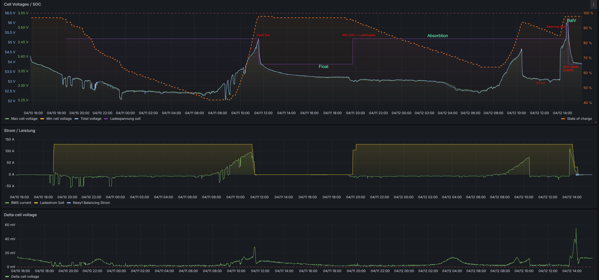
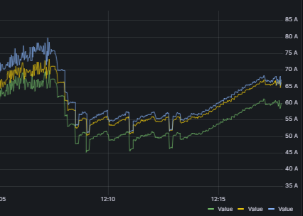
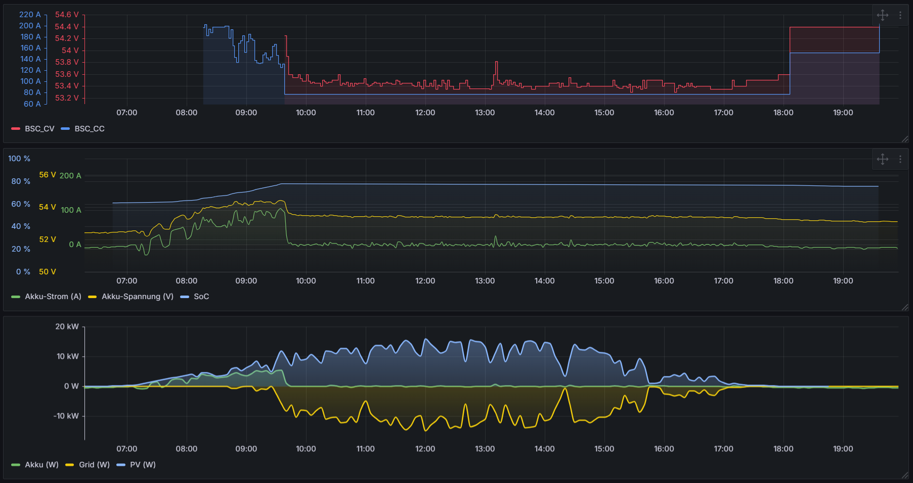
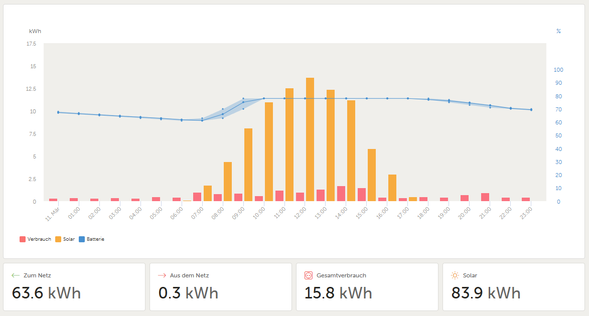

In diesem Kapitel können Sie neben der Definition des angeschlossenen Wechselrichters auch das Lade- und Entladehandling konfigurieren.  
Alle prozentualen Limitierungen beziehen sich auf die in der Kategorie "[Basisdaten](settings_inverter.md#basisdaten)" eingestellten Werte.

Beispiel eines Ladezyklus inkl. Balancing-, Float- und Absorption-Voltage mit Hilfe des BSC und einer Visualisierung über HomeAssistant/Grafana:  
{  width="1300" }

## Dynamischer Ladespannungsoffset

Mit dieser Funktion kann die Ladespannung dynamisch in Abhängigkeit vom aktuellen Ladestrom angepasst werden.  
Der Offset wird linear in Relation zum Ladestrom berechnet. Für die Berechnung wird stets der kleinste Ladestrom aller Batterypacks herangezogen.  
Durch die Funktion kann ein Spannungsabfall auf der Leitung kompensiert werden.  

<div class="bsc_content"><div class="content bsc_content_left"><form><table>
<tr class='Ctr'><td class='sep' colspan='3'><b>Dynamischer Ladespannungsoffset</b></td></tr>
<tr class='Ctr'><td class='Ctd'><b>Ein/Aus</b></td><td class='Ctd'><input type='checkbox'  name='38654716992'></td><td class='t1'></td><td class='Ctd'><span class='secVal' id='s11328'></span></td></tr>
<tr class='Ctr'><td class='Ctd'><b>Strom</b></td>
<td class='Ctd'><input type='number' step='0.01' min='0' max='500' value='0.00' name='12884911232' class='fl2'></td><td class='t1'>A</td><td class='Ctd'><span class='secVal' id='s9344'></span></td></tr>
<tr><td colspan='3' class='td0'><div class='help'>Der Strom, bei dem der maximale Offset addiert wird.</div></td></tr><tr class='Ctr'><td class='Ctd'><b>Min. Offset</b></td>
<td class='Ctd'><input type='number' min='0' max='5000' value='0' name='12884911360'></td><td class='t1'>mV</td><td class='Ctd'><span class='secVal' id='s9472'></span></td></tr>
<tr class='Ctr'><td class='Ctd'><b>Max. Offset</b></td>
<td class='Ctd'><input type='number' min='0' max='5000' value='500' name='12884911296'></td><td class='t1'>mV</td><td class='Ctd'><span class='secVal' id='s9408'></span></td></tr>
</table></form></div></div>

**Parameter**  
**Ein/Aus**: Aktiviert oder deaktiviert die Funktion.  
**Strom (A)**: Stromwert, bei dem der maximale Offset angewendet wird.  
**Min. Offset (mV)**: Minimaler Offset, der zur Ladespannung addiert wird. Dieser Wert wird bei einem Ladestrom von 0 A addiert.  
**Max. Offset (mV)**: Maximaler Offset, der zur Ladespannung addiert wird. Dieser Wert wird bei dem unter *Strom* eingestellten Wert addiert.


## Ladestrom pro Pack zu groß

<div class="bsc_content"><div class="content bsc_content_left"><form><table>
<tr class='Ctr'><td class='sep' colspan='3'><b>Ladestrom pro Pack zu groß</b></td></tr>
<tr><td colspan='3' class='td0'><div class='help'>Ladestrom drosseln wenn der Ladestrom eines Packs überschritten wird</div></td></tr><tr class='Ctr'><td class='Ctd'><b>Ein/Aus</b></td><td class='Ctd'><input type='checkbox'  name='38654716352'></td><td class='t1'></td><td class='Ctd'><span class='secVal' id='s10688'></span></td></tr>
</table></form></div></div>

Mit dieser Funktion wird der Ladestrom automatisch und dynamisch angepasst, um sicherzustellen, dass der maximale Ladewert eines jeden Batterie-Packs nicht überschritten wird. Diese intelligente Regelung schützt die Batterie vor Überstrom.

Die folgende Grafik veranschaulicht die Ströme von drei Batteriepacks während eines Ladeprozesses:
{  width="600" }  
Grün zeigt den Stromverlauf für Pack 1, Gelb von Pack 2 und Blau von Pack 3.

In der Darstellung ist zu erkennen, dass der maximale Ladestrom für Pack 1 (grün) für eine kurze Zeit auf 50A reduziert wurde (dies ist in der Mitte des Diagramms sichtbar). Nachdem der Wert reduzierte wurde, regelt der BSC den Ladestrom dynamisch herunter und hält ihn auf den eingestellten Wert von 50A.


## Ladestrom Zell-Spannungsabhängig drosseln

Mit dieser Funktion wird der Ladestrom automatisch reduziert, sobald eine definierte Zellspannung überschritten wird.  
Dadurch lässt sich ein sanftes Erreichen der Zielspannung sicherstellen und eine Überladung einzelner Zellen vermeiden.  

<div class="bsc_content"><div class="content bsc_content_left"><form><table>
<tr class='Ctr'><td class='sep' colspan='3'><b>Ladestrom Zell-Spannungsabhängig drosseln</td></tr>
<tr class='Ctr'><td class='Ctd'><b>Ein/Aus</b></td><td class='Ctd'><input type='checkbox'  name='38654710400'></td><td class='t1'></td><td class='Ctd'><span class='secVal' id='s4736'></span></td></tr>
<tr class='Ctr'><td class='Ctd'><b>Starten bei Zellspg. gr&ouml;ßer</b></td>
<td class='Ctd'><input type='number' min='2500' max='5000' value='3325' name='12884906688'></td><td class='t1'>mV</td><td class='Ctd'><span class='secVal' id='s4800'></span></td></tr>
<tr><td colspan='3' class='td0'><div class='help'>Sobald die h&ouml;chste Zellspannung diesen Wert &uuml;bersteigt wird die Drosselung aktiv.</div></td></tr><tr class='Ctr'><td class='Ctd'><b>Maximale Zellspannung</b></td>
<td class='Ctd'><input type='number' min='2500' max='5000' value='3300' name='12884906752'></td><td class='t1'>mV</td><td class='Ctd'><span class='secVal' id='s4864'></span></td></tr>
<tr><td colspan='3' class='td0'><div class='help'>Sobald die h&ouml;chste Zellspannung diesen Wert &uuml;bersteigt wird nur noch mit dem Mindest-Ladestrom geladen.<br>Hinweis: Der Wert muss gr&ouml;ßer sein als die Zell-Startspannung.<br>Achtung: Bei aktivem Autobalancing wird diese Spannung durch die Balance-Zellspannung ersetzt!</div></td></tr><tr class='Ctr'><td class='Ctd'><b>Maximale Zellspannung (Float)</b></td>
<td class='Ctd'><input type='number' min='0' max='5000' value='0' name='12884915008'></td><td class='t1'>mV</td><td class='Ctd'><span class='secVal' id='s13120'></span></td></tr>
<tr><td colspan='3' class='td0'><div class='help'>0 = deaktiviert: Es wird dann auch bei Float die maximale Zellspannung genommen.</div></td></tr><tr class='Ctr'><td class='Ctd'><b>Mindest Ladestrom</b></td>
<td class='Ctd'><input type='number' min='0' max='200' value='5' name='4294972288'></td><td class='t1'>A</td><td class='Ctd'><span class='secVal' id='s4992'></span></td></tr>
</table></form></div></div>

**Ein/Aus**:  
Aktiviert oder deaktiviert die Funktion.  

**Starten bei Zellspannung größer (mV)**:  
Zellspannung, ab der die Drosselung beginnt. Sobald die höchste Zellspannung diesen Wert überschreitet, wird der Ladestrom schrittweise reduziert.  

**Maximale Zellspannung (mV)**:  
Zellspannung, ab der nur noch mit dem eingestellten Mindest-Ladestrom geladen wird. Dieser Wert muss größer sein als die Startspannung.

**Maximale Zellspannung (Float) (mV)**:  
Separater Maximalwert für die Float-Phase.  
Einstellung **0** = deaktiviert: Es wird dann auch bei Float die maximale Zellspannung genommen.

**Mindest-Ladestrom (A)**:  
Untergrenze des Ladestroms, auf die bei Erreichen der maximalen Zellspannung reduziert wird.  
  
!!! warning "Achtung"
    Bei **aktiviertem Autobalancing** wird die *maximale Zellspannung* automatisch durch die Balance-Zellspannung ersetzt.  


## Ladestrom reduzieren bei Zelldrift

Mit dieser Funktion wird der Ladestrom reduziert, sobald eine zu große Spannungsdifferenz (Drift) zwischen den Zellen festgestellt wird.  
Dies hilft, den Drift zu begrenzen. Ein verbauter Balancer kann so effektiv arbeiten, und die Funktion sorgt dafür, dass der Ladestrom so weit reduziert wird, dass die Spannungsabweichung nicht weiter zunimmt.

<div class="bsc_content"><div class="content bsc_content_left"><form><table>
<tr class='Ctr'><td class='sep' colspan='3'><b>Ladestrom reduzieren bei Zelldrift</b></td></tr>
<tr class='Ctr'><td class='Ctd'><b>Ein/Aus</b></td><td class='Ctd'><input type='checkbox'  name='38654710016'></td><td class='t1'></td><td class='Ctd'><span class='secVal' id='s4352'></span></td></tr>
<tr class='Ctr'><td class='Ctd'><b>Starten bei Zellspg. gr&ouml;ßer</b></td>
<td class='Ctd'><input type='number' min='2500' max='5000' value='3400' name='12884906432'></td><td class='t1'>mV</td><td class='Ctd'><span class='secVal' id='s4544'></span></td></tr>
<tr class='Ctr'><td class='Ctd'><b>Starten bei Drift gr&ouml;ßer</b></td>
<td class='Ctd'><input type='number' min='1' max='200' value='10' name='4294971712'></td><td class='t1'>mV</td><td class='Ctd'><span class='secVal' id='s4416'></span></td></tr>
<tr class='Ctr'><td class='Ctd'><b>Reduzierung pro weiterem mV-Abweichung um</b></td>
<td class='Ctd'><input type='number' min='1' max='200' value='1' name='4294971776'></td><td class='t1'>A</td><td class='Ctd'><span class='secVal' id='s4480'></span></td></tr>
<tr><td colspan='3' class='td0'><div class='help'>Die Reduzierung bezieht sich auf den eingestellten Maximalstrom</div></td></tr>
</table></form></div></div>

**Ein/Aus**:  
Aktiviert oder deaktiviert die Funktion.  

**Starten bei Zellspannung größer (mV)**:  
Zellspannung, ab der die Driftüberwachung und Stromreduzierung aktiviert wird.  

**Starten bei Drift größer (mV)**:  
Spannungsdifferenz zwischen der höchsten und niedrigsten Zelle eines Batteriepacks, ab der die Reduzierung beginnt.  

**Reduzierung pro weiterem mV-Abweichung um (A)**:  
Stromreduzierung pro zusätzlichem Millivolt Spannungsdifferenz gegenüber der gesetzten Startspannung.  
Die Berechnung erfolgt auf Basis des in den [Basissettings](settings_inverter.md#basisdaten) eingestellten Maximalstroms.  


## Ladestrom reduzieren - SoC

Mit dieser Funktion kann der Ladestrom in Abhängigkeit vom Ladezustand (State of Charge, SoC) der Batterie schrittweise reduziert werden.  
Sobald der eingestellte SoC-Wert erreicht oder überschritten wird, beginnt die Reduzierung.

<div class="bsc_content"><div class="content bsc_content_left"><form><table>
<tr class='Ctr'><td class='sep' colspan='3'><b>Ladestrom reduzieren - SoC</b></td></tr>
<tr><td colspan='3' class='td0'><div class='help'>Diese Regel wird deaktiviert, sobald der Autobalancer auf die Start-Zellspannung wartet.</div></td></tr><tr class='Ctr'><td class='Ctd'><b>Ein/Aus</b></td><td class='Ctd'><input type='checkbox'  name='38654710720'></td><td class='t1'></td><td class='Ctd'><span class='secVal' id='s5056'></span></td></tr>
<tr class='Ctr'><td class='Ctd'><b>Reduzierung ab SoC</b></td>
<td class='Ctd'><input type='number' min='1' max='99' value='98' name='4294972416'></td><td class='t1'>%</td><td class='Ctd'><span class='secVal' id='s5120'></span></td></tr>
<tr class='Ctr'><td class='Ctd'><b>Pro 1% um x A reduzieren</b></td>
<td class='Ctd'><input type='number' step='0.1' min='1' max='1000' value='1.00' name='12884907072' class='fl1'></td><td class='t1'>A</td><td class='Ctd'><span class='secVal' id='s5184'></span></td></tr>
<tr><td colspan='3' class='td0'><div class='help'>Die Reduzierung bezieht sich auf den eingestellten Maximalstrom</div></td></tr><tr class='Ctr'><td class='Ctd'><b>Mindest Ladestrom</b></td>
<td class='Ctd'><input type='number' min='0' max='100' value='0' name='4294977216'></td><td class='t1'>A</td><td class='Ctd'><span class='secVal' id='s9920'></span></td></tr>
</table></form></div></div>

**Ein/Aus**:  
Aktiviert oder deaktiviert die Funktion.  

**Reduzierung ab SoC (%)**:  
SoC-Wert, ab dem der Ladestrom reduziert wird.  

**Pro 1 % um x A reduzieren (A)**:  
Stromreduzierung pro zusätzlichem Prozentpunkt SoC oberhalb des eingestellten Startwerts. Die Berechnung erfolgt auf Basis des in den [Basissettings](settings_inverter.md#basisdaten) eingestellten Maximalstroms.

**Mindest-Ladestrom (A)**:  
Unterer Grenzwert für den Ladestrom, der auch bei fortschreitender Reduzierung nicht unterschritten wird.  

!!! warning "Hinweis"
    Die Regel wird automatisch deaktiviert, sobald der Autobalancer auf das Erreichen der Start-Zellspannung wartet.


## Ladestrom reduzieren - Temperatur

Mit dieser Funktion kann der maximale Ladestrom abhängig von der gemessenen Temperatur schrittweise reduziert werden. Hierbei werden ausschließlich die unter *Datenquelle* ausgewählten Data Devices berücksichtigt. Für die Regelung wird immer die **niedrigste gemessene Temperatur** dieser Quelle herangezogen, um die Batterie bestmöglich zu schützen.  

Die Temperaturreduzierung erfolgt anhand von bis zu vier konfigurierbaren **Temperaturregeln**. Jede Regel kann individuell aktiviert, deaktiviert und mit eigenen Sensoren sowie Start- und Endwerten konfiguriert werden.

!!! note "Hinweis"
    Diese Funktion steht nur in der **[Insider Version](insider.md)** zur Verfügung

<div class="bsc_content"><div class="content bsc_content_left"><form><table>
<tr class='Ctr'><td class='sep' colspan='3'><b>Ladestrom reduzieren - Temperatur</b></td></tr>
<tr class='Ctr'><td class='Ctd'><b>Ein/Aus</b></td><td class='Ctd'><input type='checkbox'  name='38654717056'></td><td class='t1'></td><td class='Ctd'><span class='secVal' id='s11392'></span></td></tr>
<tr class='Ctr'><td class='Ctd'><b>Sensoren</b></td>
<td class='Ctd'>
<input id='t389597630' class='toggle' type='checkbox'>
<label for='t389597630' class='lbl-toggle'>Sensoren</label>
<div class='collapsible-content'>
<div class='content-inner'>
<fieldset style='text-align:left;'>
<input type='checkbox' name='21474848000' value='0' >0<br>
<input type='checkbox' name='21474848000' value='1' >1<br>
<input type='checkbox' name='21474848000' value='2' >2<br>
<input type='checkbox' name='21474848000' value='3' >3<br>
<input type='checkbox' name='21474848000' value='4' >4<br>
<input type='checkbox' name='21474848000' value='5' >5<br>
</fieldset></div></div></td><td class='t1'></td></tr>
<tr class='Ctr'><td class='Ctd'><b>Reduzieren Start</b></td>
<td class='Ctd'><input type='number' step='0.01' min='1' max='100' value='20.00' name='17179880768' class='fl2'></td><td class='t1'>°C</td><td class='Ctd'><span class='secVal' id='s11584'></span></td></tr>
<tr class='Ctr'><td class='Ctd'><b>Reduzieren Ende</b></td>
<td class='Ctd'><input type='number' step='0.01' min='0' max='100' value='0.00' name='17179880832' class='fl2'></td><td class='t1'>°C</td><td class='Ctd'><span class='secVal' id='s11648'></span></td></tr>
</table></form></div></div>

!!! note "Hinweis"
    Die Regelung kann in beide Richtungen konfiguriert werden - sowohl für Drosselung bei steigenden Temperaturen als auch für Drosselung bei fallenden Temperaturen.

**Konfiguration**  
**Sensoren**  
In diesem Bereich können die spezifischen Temperatursensoren ausgewählt werden, die für die Regelung verwendet werden sollen. Es können ein oder mehrere Sensoren aus den verfügbaren Data Devices gewählt werden.

**Reduzieren Start**  
Hier wird die Temperatur definiert, ab der die Stromreduzierung beginnt. Diese kann sowohl höher als auch niedriger als die Endtemperatur sein.

**Reduzieren Ende**  
Diese Einstellung legt die Temperatur fest, bei der der Ladestrom vollständig auf 0 A reduziert wird. Liegt dieser Wert unter der Starttemperatur, wird bei fallenden Temperaturen gedrosselt.

---

**Funktionsweise**  
Die Regelung erfolgt linear zwischen den beiden konfigurierten Temperaturschwellen. Je nach Konfiguration wird der Ladestrom bei steigenden oder fallenden Temperaturen gedrosselt.

1. **Regelungsverhalten bei steigender Temperatur (Start < Ende)** (z.B. 20 °C → 40 °C)  
    - Unterhalb der Starttemperatur: Ladung mit maximalem Strom  
    - Zwischen Start- und Endtemperatur: Lineare Stromreduzierung bei steigender Temperatur  
    - Oberhalb der Endtemperatur: Ladestrom auf 0 A (Ladung gestoppt)  
  
    **Konfiguration:**  

    - Maximaler Ladestrom: 100 A  
    - Reduzieren Start: 20 °C  
    - Reduzieren Ende: 40 °C  

    **Regelungsverhalten:**  

    - Bei Temperaturen bis 20 °C: Ladung mit vollem Strom (100 A)  
    - Bei 30 °C (Mitte zwischen Start und Ende): Ladestrom auf 50 A reduziert  
    - Bei 40 °C und darüber: Ladestrom auf 0 A (Ladung gestoppt)  
<br>

2. **Regelungsverhalten bei fallender Temperatur (Start > Ende)** (z.B. 40 °C → 20 °C)

    - Oberhalb der Starttemperatur: Ladung mit maximalem Strom
    - Zwischen Start- und Endtemperatur: Lineare Stromreduzierung bei fallender Temperatur
    - Unterhalb der Endtemperatur: Ladestrom auf 0 A (Ladung gestoppt)

    **Konfiguration:**

    - Maximaler Ladestrom: 100 A
    - Reduzieren Start: 40 °C
    - Reduzieren Ende: 20 °C

    **Regelungsverhalten:**

    - Bei Temperaturen ab 40 °C: Ladung mit vollem Strom (100 A)
    - Bei 30 °C (Mitte zwischen Start und Ende): Ladestrom auf 50 A reduziert
    - Bei 20 °C und darunter: Ladestrom auf 0 A (Ladung gestoppt)

**Berechnung des aktuellen Ladestroms:**  
`
Aktueller Ladestrom = Maximaler Ladestrom × (Endtemperatur - Aktuelle Temperatur) / (Endtemperatur - Starttemperatur)
`


## Dynamische Ladespannungsbegrenzung

!!! danger "Warnung"
    Experimentelle Funktion

Diese experimentelle Funktion begrenzt die Ladespannung basierend auf der Zellspannung und dem Spannungsunterschied zwischen den Zellen.

<div class="bsc_content"><div class="content bsc_content_left"><form><table>
<tr class='Ctr'><td class='sep' colspan='3'><b>Dynamische Ladespannungsbegrenzung (Beta!)</b></td></tr>
<tr><td colspan='3' class='td0'><div class='help'>Sobald die Spannung einer Zelle und das Delta zwischen der niedrigsten und der höchsten Zellenspannung größer als eingestellt werden,<br>wird die Ladespannung dynamisch angepasst, um die maximale Ladeleistung zu erreichen, ohne dass die Zellen weiter auseinander driften.</div></td></tr><tr class='Ctr'><td class='Ctd'><b>Ein/Aus</b></td><td class='Ctd'><input type='checkbox'  name='38654711616'></td><td class='t1'></td><td class='Ctd'><span class='secVal' id='s5952'></span></td></tr>
<tr class='Ctr'><td class='Ctd'><b>Start-Zellspannung</b></td>
<td class='Ctd'><input type='number' min='2000' max='4000' value='3400' name='12884907904'></td><td class='t1'>mV</td><td class='Ctd'><span class='secVal' id='s6016'></span></td></tr>
<tr class='Ctr'><td class='Ctd'><b>Spg.-Delta Min/Max</b></td>
<td class='Ctd'><input type='number' min='1' max='100' value='5' name='4294973376'></td><td class='t1'>mV</td><td class='Ctd'><span class='secVal' id='s6080'></span></td></tr>
</table></form></div></div>

- **Ein/Aus:** Aktivieren oder Deaktivieren der Funktion.
- **Start-Zellspannung:** Zellspannung, ab der die Begrenzung aktiv wird.
- **Spannungs-Delta Min/Max:** Der maximale Unterschied zwischen der niedrigsten und höchsten Zellspannung.


## Spannungsregelung zur Ladestrombegrenzung

Sobald die Funktion aktiviert ist, wird die Ladespannung dynamisch angepasst, um den Ladestrom innerhalb des konfigurierten Korridors zu halten. Sollte der Ladestrom den definierten Bereich überschreiten oder unterschreiten, greift die Spannungsregelung ein und korrigiert die LAdespannung entsprechend. Zusätzlich wird der an den Wechselrichter übermittelte Ladestrom auf 0 A gesetzt.  

Die Funktion ermöglicht es z.B., den Akku nur bis zu einem bestimmten SoC zu laden, um seine Lebensdauer zu verlängern.  

!!! note "Hinweis"
    Diese Funktion steht nur in der **[Insider Version](insider.md)** zur Verfügung

<div class="bsc_content"><div class="content bsc_content_left"><form><table>
<tr class='Ctr'><td class='sep' colspan='3'><b>Spannungsregelung zur Ladestrombegrenzung</b></td></tr>
<tr class='Ctr'><td class='Ctd'><b>Ein/Aus</b></td>
<td class='Ctd'><select name='4294979136'>
<option value='0' selected>Aus</option>
<option value='128' >Ein</option>
<option value='1' >Trigger 1 (DI1)</option>
<option value='2' >Trigger 2 (DI2)</option>
<option value='3' >Trigger 3 (DI3)</option>
<option value='4' >Trigger 4 (DI4)</option>
<option value='5' >Trigger 5</option>
<option value='6' >Trigger 6</option>
<option value='7' >Trigger 7</option>
<option value='8' >Trigger 8</option>
<option value='9' >Trigger 9</option>
<option value='10' >Trigger 10</option>
</select></td><td class='t1'></td><td class='Ctd'><span class='secVal' id='s11840'></span></td></tr>
<tr class='Ctr'><td class='Ctd'><b>Aktiv ab (SoC)</b></td>
<td class='Ctd'><input type='number' min='1' max='100' value='80' name='4294979200'></td><td class='t1'>%</td><td class='Ctd'><span class='secVal' id='s11904'></span></td></tr>
<tr class='Ctr'><td class='Ctd'><b>Regelungskorridor (±)</b></td>
<td class='Ctd'><input type='number' step='0.1' min='1' max='25' value='10.00' name='4294979264' class='fl1'></td><td class='t1'>A</td><td class='Ctd'><span class='secVal' id='s11968'></span></td></tr>
</table></form></div></div>

**Einstellmöglichkeiten:**  
**Ein/Aus:**  
Die Regelung kann entweder dauerhaft aktiviert oder deaktiviert werden.  
Alternativ ist es möglich, sie nur dann zu aktivieren, wenn eine definierte Triggerbedingung erfüllt ist. Dadurch lässt sich die Regelung beispielsweise in ein Home-Automation-System integrieren, sodass sie nur im Sommer aktiv ist und im Winter die volle Kapazität der Batterie zur Verfügung steht.

**Aktiv ab (SoC):**  
Hier kann festgelegt werden, ab welchem Ladezustand (State of Charge, SoC) die Regelung in Kraft tritt. Dies ermöglicht eine gezielte Anpassung an verschiedene Anforderungen.

**Regelungskorridor (±):**  
Definiert den zulässigen Schwankungsbereich für den Ladestrom. Innerhalb dieses Korridors erfolgt keine Regelung. Über- oder Unterschreitet der Ladestrom diesen Bereich, wird die Ladespannung automatisch angepasst.

!!! note "Hinweis"
    Die Regelung tritt ausschließlich in Kraft, wenn der Autobalancer nicht aktiv ist.  

---

Die Diagramme zeigen eine Victron-Anlage mit aktivierter Spannungsregelung. Deutlich erkennbar ist, dass der Ladestrom begrenzt wird und keine Energie in den Akku fließt. Stattdessen wird die überschüssige Energie ins Netz eingespeist, während der SoC (State of Charge) über die Zeit nahezu konstant bleibt.
{ width="950" }  
{ width="950" }  


## Autobalance

Dieses Autobalance-Feature bietet eine automatisierte Lösung, um die Akkuzellen regelmäßig zu balancieren. Dadurch wird eine gleichmäßige Zellspannung erreicht, was die optimale Leistung und die Lebensdauer des Akkus unterstützt.

<div class="bsc_content"><div class="content bsc_content_left"><form><table>
<tr class='Ctr'><td class='sep' colspan='3'><b>Autobalance</b></td></tr>
<tr class='Ctr'><td class='Ctd'><b>Ein/Aus</b></td><td class='Ctd'><input type='checkbox'  name='38654715712'></td><td class='t1'></td><td class='Ctd'><span class='secVal' id='s10048'></span></td></tr>
<tr class='Ctr'><td class='Ctd'><b>Autobal. starten (Trigger)</b></td>
<td class='Ctd'><select name='4294979328'>
<option value='0' selected>Aus</option>
<option value='1' >Trigger 1 (DI1)</option>
<option value='2' >Trigger 2 (DI2)</option>
<option value='3' >Trigger 3 (DI3)</option>
<option value='4' >Trigger 4 (DI4)</option>
<option value='5' >Trigger 5</option>
<option value='6' >Trigger 6</option>
<option value='7' >Trigger 7</option>
<option value='8' >Trigger 8</option>
<option value='9' >Trigger 9</option>
<option value='10' >Trigger 10</option>
</select></td><td class='t1'></td><td class='Ctd'><span class='secVal' id='s12032'></span></td></tr>
<tr class='Ctr'><td class='Ctd'><b>Balance-Intervall</b></td>
<td class='Ctd'><input type='number' min='1' max='30' value='5' name='4294976832'></td><td class='t1'>T</td><td class='Ctd'><span class='secVal' id='s9536'></span></td></tr>
<tr><td colspan='3' class='td0'><div class='help'>Gibt die Tage an, nach denen wieder das Balancing gestartet werden soll.<br>Hinweis: Wenn der Autobalancer aktiv, dann ist in der Ballance-Zeit der Charge-Current Cut-Off deaktiviert!<br>Es muss die richtige Anzahl der Zellen in den Serial-Settings eingestellt sein!</div></td></tr><tr class='Ctr'><td class='Ctd'><b>Start Zellspannung</b></td>
<td class='Ctd'><input type='number' min='2500' max='5000' value='3300' name='12884911488'></td><td class='t1'>mV</td><td class='Ctd'><span class='secVal' id='s9600'></span></td></tr>
<tr><td colspan='3' class='td0'><div class='help'>Zellspannung die erreicht sein muss, damit der Vorgang beginnt.</div></td></tr><tr class='Ctr'><td class='Ctd'><b>Balance Mindest-Zeit</b></td>
<td class='Ctd'><input type='number' min='0' max='600' value='0' name='12884912256'></td><td class='t1'>Min</td><td class='Ctd'><span class='secVal' id='s10368'></span></td></tr>
<tr><td colspan='3' class='td0'><div class='help'>So lange läuft das Balancing mindestens</div></td></tr><tr class='Ctr'><td class='Ctd'><b>Balance-Ladespannung</b></td>
<td class='Ctd'><input type='number' step='0.1' min='20' max='60' value='55.20' name='12884911552' class='fl1'></td><td class='t1'>V</td><td class='Ctd'><span class='secVal' id='s9664'></span></td></tr>
<tr><td colspan='3' class='td0'><div class='help'>Die Max. Ladespannung wird während dem Autobalancing auf diese Spannung angehoben.</div></td></tr><tr class='Ctr'><td class='Ctd'><b>Balance-Zellspannung</b></td>
<td class='Ctd'><input type='number' min='2500' max='5000' value='3450' name='12884911744'></td><td class='t1'>mV</td><td class='Ctd'><span class='secVal' id='s9856'></span></td></tr>
<tr class='Ctr'><td class='Ctd'><b>Celldif. fertig</b></td>
<td class='Ctd'><input type='number' min='0' max='50' value='5' name='4294977024'></td><td class='t1'>mV</td><td class='Ctd'><span class='secVal' id='s9728'></span></td></tr>
<tr><td colspan='3' class='td0'><div class='help'>Balancing ist fertig, wenn die eingestellte Zelldifferenz erreicht ist.</div></td></tr><tr class='Ctr'><td class='Ctd'><b>Timeout</b></td>
<td class='Ctd'><input type='number' min='0' max='600' value='60' name='12884911680'></td><td class='t1'>Min</td><td class='Ctd'><span class='secVal' id='s9792'></span></td></tr>
<tr><td colspan='3' class='td0'><div class='help'>Ist in dieser Zeit das Balancing nicht fertig, wird der Vorgang abgebrochen.</div></td></tr><tr class='Ctr'><td class='Ctd'><b>Erweiterte Optionen</b></td>
<td class='Ctd'>
<input id='t389598300' class='toggle' type='checkbox'>
<label for='t389598300' class='lbl-toggle'>Erweiterte Optionen</label>
<div class='collapsible-content'>
<div class='content-inner'>
<fieldset style='text-align:left;'>
<input type='checkbox' name='4294979072' value='0' >Ballance-Spg. senden, sobald Startzeitpunkt erreicht<br>
<input type='checkbox' name='4294979072' value='1' >Bei Start-Zellspg.-Unterschreitung → Step 'Warte auf Start-Zellspg.'<br>
<input type='checkbox' name='4294979072' value='2' >CutOff ab Step 'Warte auf Start-Zellspg.' deaktivieren<br>
</fieldset></div></div></td><td class='t1'></td></tr>
</table></form></div></div>

Im Folgenden werden die wichtigsten Einstellungen und Abläufe beschrieben:

**Autobal. starten (Trigger)** *(Diese Option steht nur Insidern zur Verfügung)*  
Der hier konfigurierte Trigger ermöglicht es, den Autobalancer unmittelbar zu starten, wenn er sich aktuell in der Wartezeit bis zum nächsten Intervall befindet. Zu beachten ist, dass der Trigger nach dem Starten des Autobalancers manuell wieder auf „Low“ gesetzt werden muss.

**Balance-Intervall**
Mit dem Parameter Balance-Intervall kann festgelegt werden, in welchen zeitlichen Abständen ein Balancing der Akkuzellen durchgeführt werden soll. Dieser Wert bestimmt, wie häufig die Balancierung aktiviert wird, um die Zellspannungen anzugleichen.

**Startkriterien**  
Der Balancierungsprozess beginnt automatisch, wenn der definierte Balance-Intervall abgelaufen ist und im zweiten Schritt die Start-Zellspannung erreicht wurde.  
Für die Start-Zellspannung wird die höchste Zellspannung der konfigurierten Data-Devices genommen.  
Diese Startbedingungen stellen sicher, dass das Balancing unter optimalen Bedingungen durchgeführt wird.

**Balance Mindest-Zeit**  
Der Parameter Balance Mindest-Zeit gibt an, wie lange das Balancing mindestens durchgeführt werden soll, unabhängig davon, ob die Zellspannungen bereits ausgeglichen sind. Dies verhindert eine zu kurze Balancierungsdauer und sorgt für eine gründliche Anpassung der Zellspannungen.

**Balance-Ladespannung**  
Für den Balancierungsprozess wird die Ladespannung des Systems auf die vorab definierte Balance-Ladespannung angehoben. Diese Spannung sorgt dafür, dass der Balancierungsvorgang effektiv durchgeführt werden kann.

**Balance-Zellspannung**  
Der Parameter Balance-Zellspannung gibt an, wie hoch die Spannung der einzelnen Zellen während des Balancing-Vorgangs maximal ansteigen darf. Dies verhindert eine Überladung der Zellen und schützt das Akkusystem vor Schäden.

**Beendigung des Balancierungsprozesses**  
Der Vorgang wird automatisch beendet, sobald die Differenz zwischen den Zellspannungen den eingestellten Wert erreicht oder unterschreitet. Dadurch wird sichergestellt, dass alle Zellen gleichmäßig geladen sind und keine übermäßige Disparität besteht.

**Timeout**  
Mit dem Parameter Timeout wird festgelegt, nach welcher maximalen Zeit der Balancierungsprozess automatisch abgebrochen wird, falls die Zellspannungen nicht innerhalb des vorgesehenen Zeitrahmens ausgeglichen werden konnten. Dies schützt das System vor endlosen Balancierungszyklen.

**Erweiterte Optionen**  

- **Ballance-Spg. senden, sobald Startzeitpunkt erreicht**  
Wenn diese Option aktiviert ist, wird die Balance-Spannung gesendet, sobald der festgelegte Startzeitpunkt erreicht ist.  
- **Bei Start-Zellspg.-Unterschreitung → Step 'Warte auf Start-Zellspg.'**  
Ist diese Option aktiv, wird bei Unterschreiten der definierten Start-Zellspannung erneut in den Schritt *„Warte auf Start-Zellspg.“* gewechselt. Dadurch werden auch die laufenden Timer zurückgesetzt.  
- **CutOff ab Step 'Warte auf Start-Zellspg.' deaktivieren**  
Mit dieser Option wird die CutOff-Funktion bereits im Schritt *„Warte auf Start-Zellspg.“* deaktiviert.  

    !!! note "Hinweis"
        Die erweiterten Optionen stehen nur in der **[Insider Version](insider.md)** zur Verfügung

!!! note "Nach dem Balancing"
    Nach Abschluss des Balancierungsprozesses wird die Ladespannung auf das Floating-Niveau abgesenkt, um den Akku im geladenen Zustand zu halten, ohne ihn weiter zu belasten.

!!! note "Hinweise"
    * Nach einem Neustart des BSC ist keine Wartezeit bis zum ersten Balancing. Erst nach dem ersten Balancing startet der eingestellte Balance-Interval.
    * Wurde das BSC beispielsweise um 22:00 Uhr gestartet und ein Intervall von fünf Tagen eingestellt, erfolgt das nächste Balancing nicht am Morgen des fünften Tages, sondern erst am Abend des fünften Tages. Da zu diesem Zeitpunkt keine Sonnenenergie zur Verfügung steht, wird das Balancing erst am nächsten Tag gestartet, an dem die Sonne scheint.
    * Für verschiedene BMS, z.B. dem Seplos, kann die einstellbare Mindestzeit genutzt werden, um den SoC 100 zu setzen

Den genauen Ablauf des Balance-Vorgangs kann mit dem MQTT-Topic "/Inverter/autoBalState" visualisiert werden.  
Funktion der fünf verfügbaren States:

- 0: Autobalancing ist deaktiviert
- 1: BSC wartet auf den nächsten Startzeitpunkt
- 2: Balancing wurde nicht fertig und es wird am nächsten Tag wiederholt
- 3: Startzeitpunkt erreicht; BSC wartet auf die Start-Zellspannung
- 4: Start-Zellspannung erreicht; Autoblancing ist jetzt aktiv
- 5: Celldif. fertig wurde erreicht, aber die Balance-Ladespannung ist noch nicht erreicht
- 6: Balance-Ladespannung erreicht; warten bis Mindestzeit abgelaufen

??? info "Zustandsdiagramm"
    ``` mermaid
    stateDiagram-v2
        classDef movement font-style:italic;
        classDef colorOrange fill:#FFDE59
        classDef colorRed fill:#FF5757

        %% Texte
        s0: <b>Step 0</b> (Autobalancer Off)
        s1: <b>Step 1</b> (Warte auf Starttag)
        s2: <b>Step 2</b> (Warte auf nächsten Tag)
        s3: <b>Step 3</b> (Warte auf Zellspannung)
        s4: <b>Step 4</b> (Autobalancer läuft)
        s5: <b>Step 5</b> (Warte auf erreichen der Ladespannung)
        s6: <b>Step 6</b> (Balance abschließen)
        n_setAbs: Abs. setzen
        n_setFloat: Float setzen
        n_setChargeVolt: Ladespannung setzen
        n_timeout: Timeout
        n_startBalMinTime: Balance-Mindest-Zeit starten
        
        s0 --> s1 : Wenn Balancer Enabled
        s0 --> s2 : Wenn Balancer Enabled und der Balance Vorgang nicht abgeschlossen werden konnte
        s1 --> s3 : Wenn Zeitpunkt erreicht
        s2 --> s3 : Wenn Zeitpunkt erreicht
        s3 --> s4 : Wenn Startzellspannung erreicht
        s4 --> n_setAbs
        s3 --> n_setAbs : Wenn Option aktiv
        s3 --> n_setChargeVolt : Wenn Option aktiv
        s4 --> n_timeout
        s4 --> s3 : Option) Wenn Zellspannung wieder unter Startzellspannung
        s4 --> n_startBalMinTime : Wenn Ladespannung (minus Toleranz) erreicht
        s4 --> s5 : Wenn MaxCellDiff unterschritten
        s5 --> s3 : Option) Wenn Zellspannung wieder unter Startzellspannung
        s5 --> n_startBalMinTime : Wenn Ladespannung (minus Toleranz) erreicht
        s5 --> n_setChargeVolt
        s5 --> s6 : Wenn Balance-Mindest-Zeit gestartet
        s5 --> n_timeout
        s6 --> n_setChargeVolt
        s6 --> s3 : Option) Wenn Zellspannung wieder unter Startzellspannung
        s6 --> n_setFloat : Wenn Mindestzeit abgelaufen
        s6 --> s0 : Wenn Mindestzeit abgelaufen

        class n_setAbs colorOrange
        class n_setFloat colorOrange
        class n_setChargeVolt colorOrange
        class n_startBalMinTime colorOrange
        class n_timeout colorRed
    ```


## Charge-Current Cut-Off

Diese Funktion unterbricht den Ladestrom, wenn er für eine bestimmte Zeitspanne unterhalb einem eingestellten Strom-Wert liegt.  
Nach diesem Abbruch wird die bisher verwendete Soll-Lade-Spannung von der Absorption-Spannung auf die Float-Spannung gesetzt.  

<div class="bsc_content"><div class="content bsc_content_left"><form><table>
<tr class='Ctr'><td class='sep' colspan='3'><b>Charge-Current Cut-Off</b></td></tr>
<tr><td colspan='3' class='td0'><div class='help'>Liegt der Ladestrom die eingestellte Zeit (Cut-Off Time) unter dem Cut-Off Strom, wird der Ladestrom so lange auf 0 A gesetzt, bis der 'Float Ladespannung SoC' unterschritten wird.</div></td></tr><tr class='Ctr'><td class='Ctd'><b>Ein/Aus</b></td><td class='Ctd'><input type='checkbox'  name='38654715776'></td><td class='t1'></td><td class='Ctd'><span class='secVal' id='s10112'></span></td></tr>
<tr class='Ctr'><td class='Ctd'><b>Cut-Off Time</b></td>
<td class='Ctd'><input type='number' min='1' max='30000' value='300' name='12884907136'></td><td class='t1'>s</td><td class='Ctd'><span class='secVal' id='s5248'></span></td></tr>
<tr class='Ctr'><td class='Ctd'><b>Cut-Off Strom</b></td>
<td class='Ctd'><input type='number' step='0.1' min='0' max='10000' value='1.00' name='12884907264' class='fl1'></td><td class='t1'>A</td><td class='Ctd'><span class='secVal' id='s5376'></span></td></tr>
<tr class='Ctr'><td class='Ctd'><b>Start Zellspannung</b></td>
<td class='Ctd'><input type='number' min='0' max='3500' value='0' name='12884911168'></td><td class='t1'>mV</td><td class='Ctd'><span class='secVal' id='s9280'></span></td></tr>
<tr><td colspan='3' class='td0'><div class='help'>Die Regelung wird erst aktiv, wenn die Zellspannung erreicht ist.<br>0 = Startvoltage deaktiviert</div></td></tr>
</table></form></div></div>

**Ein/Aus:**  
Aktivieren oder Deaktivieren der Funktion.

**Cut-Off Time:**  
Zeitspanne, in der der Ladestrom unter einem bestimmten Wert liegen muss, bevor er auf 0 A gesetzt wird.

**Cut-Off Strom:**  
Der Cut-Off-Strom ist der Gesamt-Ladestrom, unterhalb dessen die Cut-Off-Zeit beginnt. Der Gesamt-Ladestrom wird als Mittelwert berechnet, seit die eingestellte *Start-Zellspannung* (falls vorhanden) überschritten wurde.  
Überschreitet während des Prozesses der Mittelwert des Gesamt-Ladestroms erneut den Cut-Off-Strom, setzt sich sowohl der Timer als auch der Mittelwert zurück.

**Start-Zellspannung:**  
Die Start-Zellspannung ist die Spannung, ab der die Cut-Off-Regelung aktiv wird. Sobald diese überschritten wurde und der Cut-Off-Strom unterschritten ist, bleibt der Timer aktiv.  
Ein erneutes Unterschreiten der Start-Zellspannung führt nicht zum Abbruch des Timers. Der Timer wird ausschließlich zurückgesetzt, wenn der Cut-Off-Strom erneut überschritten wird.


## SoC beim Unterschreiten der Zellspannung

Die Funktion ermöglicht, beim Unterschreiten einer definierten Zellspannung einen festgelegten Ladezustand (SoC) an den Wechselrichter zu übermitteln.

Die Funktion kann beispielsweise genutzt werden, um das Nachladen der Batterie automatisch zu veranlassen. Der Ladevorgang wird solange durchgeführt, bis die eingestellte Zellspannung für das Ladeende erreicht oder überschritten wird und wieder der normale SoC an den Wechselrichter übermittelt wird.

<div class="bsc_content"><div class="content bsc_content_left"><form><table>
<tr class='Ctr'><td class='sep' colspan='3'><b>SoC beim Unterschreiten der Zellspannung</b></td></tr>
<tr class='Ctr'><td class='Ctd'><b>Ein/Aus</b></td><td class='Ctd'><input type='checkbox'  name='38654711296'></td><td class='t1'></td><td class='Ctd'><span class='secVal' id='s5632'></span></td></tr>
<tr class='Ctr'><td class='Ctd'><b>Zellspannung Ladebeginn</b></td>
<td class='Ctd'><input type='number' min='2500' max='4000' value='3000' name='12884907584'></td><td class='t1'>mV</td><td class='Ctd'><span class='secVal' id='s5696'></span></td></tr>
<tr class='Ctr'><td class='Ctd'><b>Zellspannung Ladeende</b></td>
<td class='Ctd'><input type='number' min='0' max='4000' value='0' name='12884907776'></td><td class='t1'>mV</td><td class='Ctd'><span class='secVal' id='s5888'></span></td></tr>
<tr><td colspan='3' class='td0'><div class='help'>Wenn Zellspannung Ladeende 0, dann wird geladen, bis die Zellspannung Ladebeginn wieder überschritten wird.</div></td></tr><tr class='Ctr'><td class='Ctd'><b>SoC</b></td>
<td class='Ctd'><input type='number' min='0' max='100' value='9' name='4294973056'></td><td class='t1'>%</td><td class='Ctd'><span class='secVal' id='s5760'></span></td></tr>
<tr class='Ctr'><td class='Ctd'><b>Sperrzeit zwischen zwei Nachladungen</b></td>
<td class='Ctd'><input type='number' min='0' max='3600' value='600' name='12884907712'></td><td class='t1'>s</td><td class='Ctd'><span class='secVal' id='s5824'></span></td></tr>
</table></form></div></div>

**Einstellungen**
**Ein/Aus**:  
Aktiviert oder deaktiviert die Funktion.  

**Zellspannung Ladebeginn (mV)**:  
Zellspannung, bei deren Unterschreiten das Nachladen gestartet wird.  

**Zellspannung Ladeende (mV)**:  
Zellspannung, bei deren Erreichen das Nachladen beendet wird. Wird dieser Wert auf 0 gesetzt, erfolgt das Laden so lange, bis die Zellspannung wieder über die Ladebeginn-Spannung steigt.  

**SoC (%)**:  
Ladezustand, der beim Unterschreiten der Ladebeginn-Spannung an den Wechselrichter gesendet wird.  

**Sperrzeit zwischen zwei Nachladungen (s)**:  
Zeitspanne, die mindestens zwischen zwei Nachladevorgängen vergehen muss.
