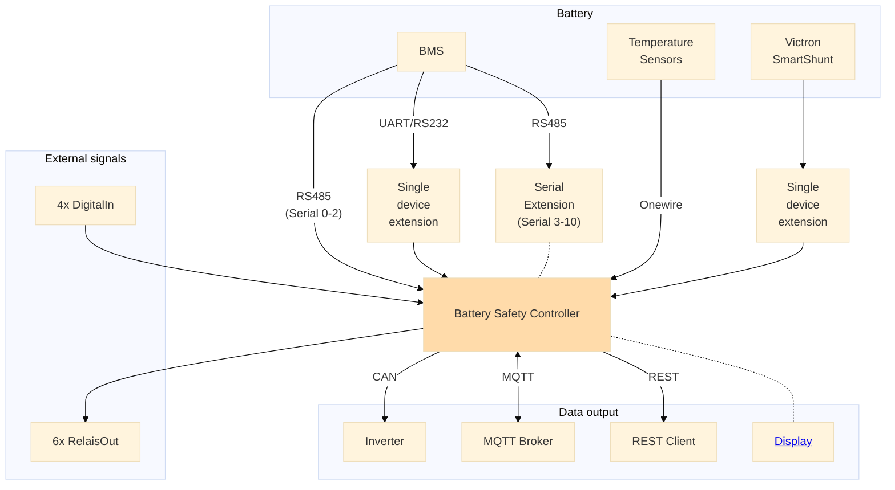

## Systemüberblick
Der BSC ist ein frei konfigurierbarer Controller, welcher eine Schnittstelle zwischen den verschiedenen Komponenten eines DIY Batteriesystems realisiert. Er kann eine Vielzahl an Kontroll- und Überwachungsaufgaben übernehmen, unter anderem die zentrale Ladesteuerung des Speichersystems.

## Komponenten
* **BSC:** Der BSC besteht aus einer Platine und der darauf laufenden Software. Er besitzt verschiedenste Schnittstellen, um mit den externen Komponenten kommunizieren zu können (WLAN, Bluetooth, RS485, CAN-Bus, Onewire, digitale Ein- und Ausgänge)
* **Display:** optional kann an den BSC ein Display angeschlossen werden, welches über einen I2C-Bus mit dem BSC kommuniziert. Weitere Informationen finden sich [hier](hardware.md#bsc-display). Es bietet sich an, BSC und Display in [diesem Gehäuse](https://bsc-shop.com/produkt-kategorie/gehaeuse/) zu betreiben. 
* **Single device extension:** Die SDE bietet einen einfachen Anschluss von nicht RS485 kompatiblen Geräten an das BSC.
* **Serial Extension:** Der BSC besitzt 3 RS485 Schnittstellen für den Anschluss von BMS. Falls weitere benötigt werden, kann das Serial Extension Board an den BSC angeschlossen werden um 8 weitere RS485 Schnittstellen zu erhalten. Siehe [das entsprechende Github-Repo](https://github.com/shining-man/bsc_extension_serial)
* **BMS:** Verschiedene BMS können über RS485, CAN, oder Bluetooth verbunden werden. Von diesen werden dann aktuelle Zustandsinformationen der Batterien, wie Zellspannungen, SOC oder Temperaturen abgerufen. Siehe [hier im Wiki](devices/bms.md)
* **Temperatursensoren:** Es können zusätzliche Temperatursensoren über Onewire oder Digital- bzw. Analogeingänge angeschlossen werden, welche die Informationen des angeschlossenen BMS ergänzen.
* **Shunt:** Der BSC kann den SoC einer Batterie von einem externen Shunt abrufen. Derzeit wird der Victron SmartShunt unterstützt. Für die Anbindung wird die Single device extension benötigt.  
Siehe [hier](devices/externer_shunt.md)
* **Inverter:** Der BSC kommuniziert mit verschiedenen Wechselrichtern über CAN-Bus, wie z.B. Victron, Solis oder DEYE. Dabei kann der aktuelle Batteriezustand gemeldet werden, und auch Konfigurationsparameter, wie z.B. zur Ladesteuerung, gesetzt werden.  
Siehe [hier](devices/wechselrichter.md)

## Verfügbare Schnittstellen
* **WLAN:** Zugriff auf das BSC-Webinterface, Übertragung von MQTT-Daten
* [**RS485:**](hardware.md#rs485-bms) Abruf von BMS-Daten
* [**CAN Bus:**](hardware.md#canrs485) Kommunikation mit Wechselrichtern
* [**Onewire:**](hardware.md#onewire) Abruf von Sensordaten, wie z.B. Temperatursensoren
* [**Digitale Eingänge:**](hardware.md#digitale-eingange) Empfang von digitalen Sensordaten über einen galvanisch getrennten Eingang
* **Digitale Ausgänge:** Steuerung von externen Geräten über Relais
* [**MQTT Broker:**](mqtt.md) Übertragung von Batterie- und BSC-Zustandsinformationen beispielsweise zu einer Hausautomation um diese langfristig zu speichern und zu visualisieren (z.B. über Grafana)
* [**REST Client:**](restapi.md) Zustandsdaten über die überwachten Batterien oder über den BSC können über eine HTTP REST API abgerufen werden
